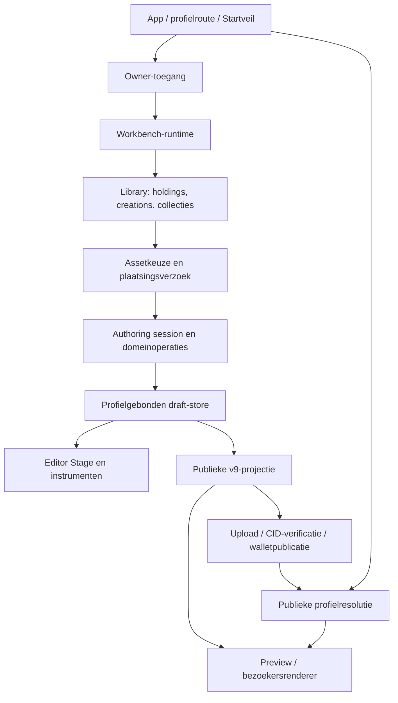

# INSCAPE — architectuur, styling en schaalgedrag

Datum: 6 september 2026. Onderzoek met uitvoeringsregistratie van de daarna
goedgekeurde vereenvoudiging; geen nieuwe productautoriteit.
Meetprogramma's, resultaten en screenshots staan in `.browser-test-runtime`.

## Besluit na verduidelijking van de productvisie

**Aanbeveling: INSCAPE niet volledig opnieuw bouwen. De bestaande
compositiekern behouden en de koppeling tussen Workbench, Display Module en
publicatie gericht herstructureren. Alleen kleine opruimacties zijn onvoldoende.**

Deze herbeoordeling volgt op het gewijzigde contract van 6 september: één
publieke desktop per profiel, zelfstandige module-instanties en tijdelijke
bezoekersinteractie. De eerdere beoordeling hieronder was vooral gericht op
de huidige editor en prestaties. Waar die spreekt over uitsluitend private
Workbench-inrichting, is het bijgewerkte contract leidend.

Dit is een technische aanbeveling op basis van de geïnspecteerde code en
uitgevoerde controles, geen garantie op foutloos toekomstig onderhoud. Er is
geen alternatieve app gebouwd om een kostenverschil empirisch te meten.

### Waarom deze route

1. De bewerkingskern heeft al een echte grens. `systemWorkflowAuthoringSession`
   ontvangt een store, voert domeinoperaties uit en commit voltooide handelingen.
   De store ontvangt opslag als afhankelijkheid. De analyse van letterlijke
   lokale imports vindt 18 bestanden in `src/systemWorkflow`, met 29 bestanden
   in hun gezamenlijke transitieve afhankelijkheden en **geen JSX of CSS**.
   Er is dus geen noodzaak de UI te herbouwen om geometrie of opslag te behouden.
   Dit is geen bewijs van volmaakte domeinisolatie: gedeelde configuratie en
   helpers liggen nog onder Library, profileDocument en lattice/rendering.
2. De verkeerde koppelingen zijn concreet aanwijsbaar. De runtime bezit één
   controller, één board-instantietoestand, crop, selectie, instrumenten en
   playback. `PresentationBoardDefinitive` combineert het Workbench-oppervlak,
   shortcut, opslag, venstergeometrie en Display-specifieke controls. Dit is
   omvangrijk herstructureringswerk, maar geen onbegrensd probleem in alle lagen.
3. Een nieuwe app zou dezelfde ontbrekende productgrenzen moeten ontwerpen:
   module-identiteit, publieke startsituatie, tijdelijke bezoekersstaat en
   documentmigratie. Een nieuw project verwijdert dat werk niet. Daarbovenop
   komen het opnieuw aansluiten of herschrijven van de al werkende ervaringen.
4. Er zijn waardevolle gedragscontroles. De huidige bewerkings- en opslagtests
   controleren onder andere stale writes, mislukte opslag, profielisolatie en
   één commit per voltooide handeling. Browsertests controleren de eerder
   lastige swipe- en plaatsingsgrenzen. Die zekerheid behouden is waardevol.
5. Er is geen aangetoonde noodzaak React, de DOM-renderer, de visuele taal of
   de hele assetintegratie te vervangen. De prestatieproblemen hieronder hebben
   concrete oorzaken die ook in een nieuwe app vermeden zouden moeten worden.

### Vergelijking van de drie routes

| Route | Wat lost ze op? | Kosten en risico | Oordeel |
| --- | --- | --- | --- |
| Alleen lokaal opruimen en verder uitbreiden | Dubbele code, onnodige validatie en verouderde restanten | Laagste onmiddellijke ingreep, maar de koppeling profiel = compositie = venster blijft staan | Onvoldoende voor de geaccepteerde richting |
| Bestaande kern behouden, Workbench/Display-grenzen gericht vervangen | Eigenaarschap, zelfstandige instanties, doelgerichte Library-input en een latere publieke desktop | Gerichte UI-herstructurering; documentwijzigingen later expliciet migreren; gedrag per stap controleren | **Gekozen route** |
| Volledige herbouw | Vrijheid om alle grenzen opnieuw te ontwerpen | Dezelfde ontwerp- en migratievragen, plus opnieuw bouwen/aansluiten van werkende functies en risico op twee langdurige implementaties | Geen aangetoond voordeel dat die extra last rechtvaardigt |

De vergelijking is kwalitatief. Er worden geen fictieve percentages hergebruik,
regelaantallen als kwaliteitsscore of ongefundeerde tijdsbeloften gebruikt.

### Concrete bevindingen en behandeling

| Bevinding en codebewijs | Gevolg | Behandeling |
| --- | --- | --- |
| `OwnerSystemWorkflowRuntime.jsx` maakt één controller en beheert crop, playback, instrumenten, Library, profiel en publiceren | Workbench kent de interne werking van de Display Module | Compositie-aansturing bijeenbrengen onder de bestaande Display Module; Workbench houdt vensters en diensten. Geen tweede runtime naast de eerste onderhouden |
| `PresentationBoardDefinitive.jsx` beheert shortcut én canvasvenster; `presentationBoardShortcutStorageKey` gebruikt alleen het profiel | Een tweede instance kan niet onafhankelijk worden opgeslagen | Eerst de bestaande window/shortcut-verantwoordelijkheid van compositie scheiden. Instance-identiteit en opslagmigratie expliciet ontwerpen voordat meerdere instances worden ingeschakeld |
| `OwnerSystemWorkflowLibraryWorkspace.jsx` zoekt `document.querySelector('.system-workflow__canvas')` en berekent Display-geometrie | Library kiest impliciet het eerste canvas en kent de doelmodule te goed | Module laat een concreet doel en plaatsingshandeling aansluiten; Library levert assetreferentie en drag-informatie. Bestaand gedrag behouden, geen algemene pluginbus bouwen |
| `DisplayInstruments.jsx` gebruikt documentbrede triggerqueries, één `.system-workflow` portal en vaste `display-tab-*` IDs | Meerdere instances zouden focus en IDs delen | Refs, IDs en portals scopen op de eigenaar. De content blijft Display-eigendom, ook in een los venster |
| `profileDocumentV9Validation.js` vereist exact één artboard/geometry/appearance en `grids`; builder projecteert één draft; Visitor leest direct `document.grids` | v9 kan de geaccepteerde publieke desktop niet vertegenwoordigen | v9-reader behouden. Later een expliciete nieuwe documentversie/adapter met module-inhoud en publieke layout; geen onbekende velden in v9 verstoppen |
| Publisher valideert zelf v9 en gebruikt een concrete published-profile resolver | Publicatie is apart georganiseerd, maar nog niet volledig documenttype-onafhankelijk | Verificatie van bytes, snapshot, account en transactie behouden; documentversie-afhandeling bij de toekomstige migratie aanpassen. Geen claim dat de writer volledig ongewijzigd kan blijven |
| `systemWorkflowNavigation.js` valideert het hele document; Canvas roept dit meermaals per render aan; session/store leveren kopieën | Navigatiekosten groeien met alle placements, ook bij ongewijzigde inhoud | Gevalideerde toestand en lichte navigatiegegevens scheiden. Niet blind alle validatie of kopieerbescherming verwijderen |
| Importcirkel: Movement → latticeProductionProjection → Transform → Resize → Movement | Projectie trekt bewerkingscode mee; grenzen zijn moeilijker te begrijpen | Gemeenschappelijke geometrieberekeningen een eenrichtingsafhankelijkheid geven; projectie mag niet afhangen van commando's die haar zelf gebruiken |
| Oude `OWNER_METADATA_*` machine en `ownerWorkbenchModuleAvailability` hebben in de bronzoektocht alleen testgebruik; de actieve runtime gebruikt `displayInstrumentState` | Twee verklaringen voor één huidig gedrag | Oude exports en bijbehorende uitsluitend oude tests verwijderen na gerichte referentiecontrole; huidige state machine en werkende instrumenten behouden |
| `OwnerSystemWorkflowMetadataModule.jsx` exporteert gebruikte content én een oude default windowcomponent waarvoor geen importer gevonden is | Dode UI en bronpatroontests bemoeilijken onderhoud | Gebruikte metadata-content behouden, oude wrapper gericht verwijderen; geen hele metadatafunctie weggooien |
| `useLibraryStore` bevat ook canvasObjects/tablePlacements en oudere workspaceformaten | Materiaalcatalogus en voormalige editors leven in één store | Actieve consumers en migratielezers onderscheiden. Ongebruikte authoring-commands uit de actieve laag halen; bestaande opgeslagen gegevens niet wissen omdat een scherm niet meer actief is |
| LibraryResults mount `assets.map(...)`; lazy images virtualiseren de kaarten niet | DOM-groei bij grote catalogi | Afzonderlijk gerichte lijstoptimalisatie; geen reden om Library-resolvers opnieuw te bouwen |
| Groot gedeeld stylesheet; PublicDiscoverExperience importeert ownerSystemWorkflow.css | Wijzigingen aan één oppervlak raken een brede cascade | Styles per bestaande eigenaar begrenzen met behoud van tokens, selectorgrammatica en laadvolgorde. Niet alleen knippen op regelaantal |
| UI-tests zoals ownerSystemWorkflowPolish testen veel exacte bronpatronen | Veilige refactors kunnen rood worden zonder gedragsregressie | Per gewijzigde grens relevante gedragstests laten beslissen; betekenisvolle privacy- en buildgrenzen blijven expliciet gecontroleerd |

De gevonden importcirkel omvat vier bestanden; de statische scan vond één
dergelijke groep. Dat is bewijs van een lokale afhankelijkheidsfout, niet van
een volledig cyclische app. De scan kijkt naar letterlijke lokale imports en
mist eventueel berekende imports en interne afhankelijkheden van packages.

### Wat behouden blijft

- Domeinoperaties voor plaatsen, verplaatsen, schalen, crop, lagen en transform;
  hun algoritmen en invarianttests blijven de basis, met gerichte ontkoppeling.
- Transactiegrens tussen tijdelijke gestures en voltooide opgeslagen edits.
- Asset-identiteit, gekozen media per placement en provenance; bestaande
  resolvers blijven bruikbaar. Geen nieuwe algemene assetstandaard nodig.
- Scheiding private draft versus publiek document, plus leescompatibiliteit
  van gepubliceerde documenten. Die grens groeit mee met modules.
- Publicatieveiligheid en walletadapters. Dit oordeel is geen nieuwe audit van
  de actuele LUKSO-specificaties of van echte wallettransacties.
- Werkende vensterpresentatie, visuele tokens, rastercorrecties en
  responsieve instrumenten. Gedeelde code blijft waar zij echte duplicatie voorkomt.

### Uitvoeringsvolgorde en controleerbare eindpunten

- [x] **1. Bestaand werk veilig vastleggen.** Gecontroleerde commits en push op
   `feature/presentation-board-foundation`. Lokale browseruitvoer, beschermde
   handoff, exports, imagegen-ontwerpen en lokale CREEPS-herstelbestanden blijven
   buiten de commits. De reeds aangesloten ontwikkeltool blijft broncode en
   wordt niet uitgevoerd. Bewijs: volledige tests, browserchecks, standaarden,
   build en vergelijking van lokale en remote commit.
- [x] **2. Bewerkingskern vereenvoudigen.** Navigatie losmaken van volledig documentwerk en de concrete geometriecirkel
   verbreken. Gereed wanneer navigatie geen volledige validatie per render
   uitvoert, de importcirkel weg is en geometrie-/swipetests hetzelfde gedrag tonen.
- [x] **3. Display Module zelfstandig maken.** De bestaande Display-aansturing afbakenen: selectie, crop, viewer,
   instrumenten en playback horen bij de compositie; venster/shortcut bij de
   host. Gereed wanneer de host geen geselecteerde placement hoeft te inspecteren
   om Metadata of Layers aan te sturen. Geen generiek pluginframework toevoegen.
- [ ] **4. Workbench en module expliciet verbinden.** Venster/shortcutbeheer
   scheiden van compositiegedrag. Library-drop en focus op de bestaande module richten zonder documentbrede
   'eerste canvas'-aannames. Gereed wanneer het doel expliciet is en uitgestelde
   media nog steeds correct annuleren bij sluiten of wisselen.
- [ ] **5. Restanten en styling opruimen.** Oude Metadata-paden en verouderde actieve commands opruimen zodra hun
   vervangers afgedekt zijn; bijbehorende bronpatroontests herzien. Styling
   begrenzen langs de dan duidelijke eigenaars. Geen brede naamwijziging tegelijk.
- [ ] **6. Eindcontrole en checkpoint.** De volledige workflows en de nieuwe
   verantwoordelijkheden toetsen aan deze audit. Verwijderde koppelingen en
   resterende beperkingen benoemen; getest eindpunt committen en pushen.

De publieke Workbench en meerdere module-instanties vragen daarna een
afzonderlijk ontworpen en geteste document-/opslagmigratie. Ze zijn geen onderdeel
van deze vereenvoudigingsronde. Geen nieuw moduletype of pluginframework bouwen.

Checkpoint van de bestaande code: `fd2adec10c9febecff1157a09d3bb0b968d5dd2c`.
Gepusht naar `feature/presentation-board-foundation`; remote hash gecontroleerd
op 6 september 2026. Dit bewaart de opeengestapelde werkende wijzigingen vóór
de architecturale vereenvoudiging. De voortgang erna staat hieronder.

Verificatie van dit checkpoint: de ongewijzigde codebasis had 767 geslaagde
unitchecks en een geslaagde build/buildcontrole uit de audit. Aanvullend zijn
5 standaardchecks, Library-images, Library-storage en publicatieherstel
geslaagd. Bezoekers- en opstarttests hadden bij de gelijktijdige uitvoering
testserver/readiness-timeouts; afzonderlijke uitvoering slaagde met respectievelijk
12 en 12 checks. Geen timeouts verhoogd of productgedrag veranderd om dit te
verbergen. De enige bronopmaakcorrectie bij het vastleggen was een overtollige
lege eindregel in de bestaande ontwikkeltool-CSS.

### Stap 2: navigatie en geometrie

De Canvas bepaalt vorige/volgende Grids nu uit de scène-ID-volgorde van zijn
geaccepteerde draft. De bestaande documentvalidatie blijft bij de domeingrens.
Bij 100 losse navigatievragen doet het oude documentpad 100 structured clones;
de nieuwe volgordeberekening doet er nul. Dit is geen gemeten UI-versnelling:
session/store-kopieën en andere documentbewerkingen zijn hiermee niet verwijderd.

De ongewijzigde placementprojectie woont nu in het bestaande
`systemWorkflowViewportProjection.js`. Movement en Resize importeren haar daar;
de renderer behoudt zijn bestaande export als alias. Daardoor verdwijnt de
vierbestands-importcirkel. De scan van letterlijke lokale imports vindt nu nul
cyclische groepen; berekende imports en package-internals vallen buiten de scan.
Er zijn geen nieuwe bronbestanden, schema's, modules of CSS-varianten toegevoegd.

Bij verificatie kwamen twee buildomgevingsproblemen naar voren: te weinig ruimte
op C: voor tijdelijke kopieën en herhaald ENOTEMPTY bij het verwijderen van
een tijdelijke recovery-map op Windows. Tests gebruiken daarom tijdelijke opslag
onder `.browser-test-runtime/step2-temp` op E:. De bestaande buildpruner krijgt
drie begrensde herpogingen; zijn padcontrole en fout bij blijvend falen blijven
bestaan. Originele recovery-assets zijn niet verplaatst of verwijderd.

Verificatie: 47 gerichte geometrie-/navigatietests en de volledige reeks van
768 tests geslaagd. Productiebuild en buildcontrole slagen (779773 initial-JS-bytes);
bestaande dependency- en chunkwaarschuwingen blijven zichtbaar.
Vijf browserchecks slagen: instrumenten (2), volle
Grid-wraparound, continue playback en plaatsingsannulering. De instrumenttest
gebruikte aanvankelijk zijn verkeerde standaardpoort 5174; met de draaiende app
op 5173 slaagt hij. De wraptest detecteert geen Stage-lekken in 586 gesamplede
frames op 2044 px en 937 op 390 px; eindbeelden op beide breedtes geïnspecteerd.
Dit is geen garantie over alle frames of mediacombinaties. Bewijs staat in
`.browser-test-runtime/step2-*`. Checkpoint: `18c06620bbfc435e5477afd9d1f221bdc8d98760`.

### Stap 3: Display-aansturing afbakenen

`DisplayModule.jsx` bezit nu de bestaande crop- en viewerhooks,
instrumenttoestand, selectie-afhankelijke Metadata/Layers, playback en
Grid-overgangen. De Workbench-runtime leest geen geselecteerde placements meer
om die instrumenten te renderen. Hij levert assets, de bestaande controller,
vensterconfiguratie en beschikbaarheid van de werkruimte. Zijn opdrachten aan
Display zijn beperkt tot Grid kiezen en Metadata openen; Display meldt of de
bestaande Metadata-menuactie beschikbaar is.

Het onderdeel blijft gemount bij minimaliseren zodat tijdelijke instrument- en
selectietoestand behouden blijven. Playback pauzeert bij een niet-actief venster,
Preview of conflicterende interactie. De gebruikte geometrie, opslagkeys,
draftschema's en CSS zijn niet aangepast. Eén nieuw bronbestand bevat de
verplaatste verantwoordelijkheid; er is geen tweede editor of pluginframework.

Dit is nog geen volledige zelfstandigheid: de controller wordt nog in de host
gemaakt en gedeeld met Library, Grids, instellingen en publicatie. Ook combineert
PresentationBoard nog het Workbench-oppervlak, shortcut en venster. Die concrete
koppelingen blijven werk voor stap 4; meerdere module-instanties zijn hiermee
niet ingeschakeld.

Verificatie: 138 gerichte ownerchecks en de volledige reeks van 768 unitchecks
slagen. Build en buildcontrole slagen met 779773 initial-JS-bytes; bestaande
dependency-/chunkwaarschuwingen blijven zichtbaar. Browserbewijs: instrumenten
en vensterlevenscyclus (3), crop (2), volle wraparound (1), playback (1) en
plaatsingsannulering (1) geslaagd. De nieuwe venstercheck controleert behoud van
Metadata/selectie na minimaliseren/heropenen, de viewer en de Grid-opdracht
vanuit de host zonder extra draftwrites. Instrumentbeelden op 1440 en 390 px
bekeken; de volle wraptest vond geen lekken in 699 en 917 gesamplede frames op
2044 en 390 px. Dit bewijst niet alle frames of iedere mediacombinatie.

De uitvoering werd onderbroken door een VS Code-herstart na geheugenuitputting
in een testproces. Een achtergebleven, geïdentificeerde headless screenshotbrowser
is afgesloten; de lokale Vite-server is opnieuw gestart. Zware browserchecks
zijn daarna afzonderlijk uitgevoerd, zonder hun tijdslimiet te verhogen.
De oude croptest verwees naar een verdwenen region en één img per artwork.
De huidige toolbar en de hoge-resolutieafbeelding worden nu expliciet gebruikt.
De resterende meetverschillen zijn ook met de gecommitte stap-2-runtime
gereproduceerd op een tijdelijke vergelijkingsserver, zonder bronbestanden te
vervangen. Native Fit bevat de bestaande twee verticale bleedpixels; resize
vergelijkingen houden rekening met twee pixel-afgeronde maskers maal de cropzoom
(gemeten verschil ongeveer 1,3 px). Opslagtellingen, zoom en Done/Cancel-uitkomsten
blijven gecontroleerd. Productiegeometrie is niet gewijzigd om tests te laten slagen.
De vergelijkingsserver is afgesloten. Bewijs: `.browser-test-runtime/step3-*`.
Stappen 4–6 blijven open.

Bewaar bij volgende stappen steeds het bewijs en de commitverwijzing hier.
De checklist is uitvoeringsregistratie; het actieve contract blijft de enige
productautoriteit.

Stappen zijn reviewbare onderdelen, geen schatting dat alles in vijf kleine
commits klaar is. Na elke afgeronde grens een gecontroleerd checkpoint. Als
behoud van de kern alsnog structureel onmogelijk blijkt, moet dat met een
concrete blokkade worden aangetoond; niet stilzwijgend blijven patchen.

### Verificatie en grenzen van deze herbeoordeling

- Huidige volledige `npm test`: **767 geslaagd**, geen failures of skips.
- Bestaande browsertests: **5 geslaagd** voor Display-instrumenten, volle
  raster-Grids bij snelle wraparound, continue playback en annuleren van
  plaatsing. Wraptest: 690 gesamplede frames op 2044 px en 927 op 390 px, geen
  door de test gedetecteerde Stage-lekken. Eindbeelden op beide breedtes bekeken.
  Dit bewijst niet ieder browserframe of iedere mogelijke mediacombinatie.
- Vite-productiebuild bevestigd met native **exitcode 0**; `build:check` slaagde met
  779782 initial-JS-bytes. PowerShell rapporteerde bij de eerste wrapper een
  NativeCommandError voor dependencywaarschuwingen; daarom is de native exitcode
  apart gecontroleerd. Bestaande chunk-/dependencywaarschuwingen zijn behouden.
- Import- en CSS-analyse opnieuw uitgevoerd op huidige bronnen. Eerdere
  schaalmetingen hieronder zijn behouden als eerdere experimenten, niet als
  vandaag opnieuw gemeten prestaties of een productiecapaciteitsbelofte.
- Routes, runtime, Display/Library/instrumenten, domeinoperaties/store,
  publieke builder/validator/visitor en publicatiegrenzen zijn onderzocht.
  Geen volledige regel-voor-regel audit van iedere repositoryfile; geen
  penetrationtest, nieuwe afhankelijkhedenaudit, echte walletactie, mobiele
  hardwaretest, langdurige geheugentest of nieuwe moduleprototype.
- Geen code of schema gewijzigd. Dit bestaande verslag is bijgewerkt; bewijs
  staat lokaal onder `.browser-test-runtime/architecture-decision-*`.

## Eerdere prestatiebeoordeling en metingen

De onderstaande beoordeling is opgesteld vóór de publieke-desktopverduidelijking.
De meetresultaten blijven bewijs voor de onderzochte scenario's; bovenstaande
beslissing vervangt de eerdere productinterpretatie en uitvoeringsprioriteit.

### Eerder oordeel

De scheiding tussen private compositie, lokale Workbench, publiek document en
walletpublicatie is bruikbaar en moet behouden blijven. Geen aangetoonde reden
voor een algemene rewrite, andere UI-technologie of een nieuw designsysteem.

De belangrijkste nu aangetoonde schuld is **herhaald volledig documentwerk in
een interactieve renderlus**. Dat verdient voorrang boven cosmetisch opsplitsen
van grote bestanden. Daarnaast groeien de Library-DOM en de publieke documentbytes
met het aantal items. De styling heeft vooral organisatie- en onderhoudsschuld;
deze review heeft geen algemene instabiliteit van de huidige visuele taal bewezen.

Mijn eerdere voorstel om eerst venstercomponenten te splitsen was een inschatting.
De metingen hieronder maken navigatievalidatie de beter onderbouwde eerste stap.

## Richting, gedrag en aannames

| Soort | Betekenis voor deze review |
| --- | --- |
| Geaccepteerde richting | Workbench > Display Module > Stage > Grid > placements. Lokale editorvoorkeuren worden niet gepubliceerd. Identiteit en assetprovenance blijven onderscheiden. Visuele identiteit behouden. Bron: actieve contract. |
| Productbetekenis | Assets zijn herbruikbaar compositiemateriaal. Resident, rijkere assetpakketten en meerdere modules zijn context voor toekomstige uitbreidbaarheid, geen reeds gebouwde functies of opdracht tot platformbouw. Bron: creative intent. |
| Implementatie | Er zijn een canonieke authoring session, profielgebonden opslag, aparte publieke projectie en twee renderpaden voor editor en bezoeker. De app is nog sterk rond één Display Module georganiseerd. |
| Werkhypothese voor prioriteit | Eerst soepel componeren met een grotere eigen catalogus. Dit volgt uit het eerdere gebruiksdoel; aantallen uit de tests zijn meetpunten, geen beloofde productcapaciteiten. Er is geen antwoord ontvangen op de aanvullende prioriteitsvraag tijdens deze review. |

## Structuur en verantwoordelijkheden



De pijlen geven verantwoordelijkheden en gegevensstromen weer, niet ieder import.
De editor en bezoeker delen domein/geometrie, maar niet één identieke renderer.

- `App.jsx`, `OwnerRuntimeBoundary.jsx` en Startveil bepalen route, profiel,
  toegang en gereedheid. De owner-runtime wordt apart geladen en per profiel
  gemount. Dat is een nuttige grens, geen overbodige laag.
- `useOwnerLatticeBrowser.js` combineert Library, creations en collection tokens.
  De adapter maakt daar bruikbare browserrecords van. Huidig houden, creator-
  attribution en uitgifte zijn verschillende gegevens; niet tot één eenvoudige
  ownership-boolean reduceren om de code korter te maken.
- `OwnerSystemWorkflowRuntime.jsx` organiseert ook afmetingen, crop, selectie,
  instrumenten, playback, panelen en publicatie. Met 32 lokale imports is dit
  een duidelijke samenkomst van verantwoordelijkheden. Het aantal bewijst geen
  fout, maar verklaart waarom een verandering veel omringende kennis vraagt.
- `PresentationBoardDefinitive.jsx` omvat venstergeometrie, shortcut/icoonbewerking,
  menu's en instrumenthosts. Een logische latere splitsing is venster en shortcut,
  met behoud van de bestaande opslagkeys en componentcontracten.
- `systemWorkflowAuthoringSession.js` maakt bewerkingen expliciet, met verwachte
  toestand/generation en gecontroleerde commits. `systemWorkflowDraftStore.js`
  beschermt bestaande data tegen corruptie, opslagfouten en reeds zichtbare
  externe wijzigingen. Deze grenzen zijn waardevol.
- `profileDocumentV9Builder.js` maakt een afzonderlijke publicatieprojectie;
  private Grids/placements worden gefilterd. De reader verifieert schema,
  canonieke bytes, profiel en hash. Het nieuwe publicatieherstel is een apart
  ontvangstbewijs, geen tweede draft of nieuwe bron van wallet-authority.

## Gevolgde workflows

| Workflow | Gevolgd codepad | Beoordeling |
| --- | --- | --- |
| Asset naar Stage | Library-union/adapters → image chooser → LibraryWorkspace/Canvas → placement request → authoring session → store | Goede token/placement-scheiding; twee invoerpaden delen al requestlogica. Dimensieresolutie en annulering verdienen behoud van hun grenzen. |
| Bewerken en opslaan | Pointer-preview → movement/resize/crop-domein → afgeronde commit → opnieuw renderen | Correct onderscheid tussen tijdelijk slepen en duurzaam opslaan. Wel meerdere volledige documentbewerkingen per afgeronde opdracht. |
| Grid navigeren/afspelen | Canvas → adjacentGrid → navigation-domain; lokale swipe-state en RAF-playback | Aangetoonde overmatige validatie/kopieën; zie bevinding 1. |
| Metadata en lagen | Selectie via controller → Layers en Metadata-viewmodel → gedeelde instrumenthost | Selectie is gedeeld. De owner-sidecar projecteert een beperktere dossierinhoud dan de volledige assetrecords. De drie creatieve metadata-scopes zijn geen bewijs dat alle drie al volledig in deze UI bestaan. |
| Preview/publicatie/bezoek | v9 builder → Preview/bezoekersrenderer; upload/CID/wallet → publieke resolver | Sterke inhoudsgrens. Eigen renderpaden vragen blijvende pariteitschecks. Capaciteitsverschil tussen draft en publiek document is gemeten. |
| Ontdekken en activiteit | Discover-controller/repository → gedeelde workspace; Signals-store → Activity | Discover hergebruikt owner-workspacecode en styles. Signals heeft nog eigen debounced opslag en statepatronen. Een reactiequeue is geen geïmplementeerde resident-engine. |

## 1. Navigatie doet te vaak volledige draftvalidatie — gemeten, eerste prioriteit

Bronnen:

- `src/public/ownerSystemWorkflow/OwnerSystemWorkflowCanvas.jsx:84`, `:111`:
  vorige/volgende Grids worden tijdens renderen afgeleid.
- `src/systemWorkflow/domain/systemWorkflowNavigation.js:21`:
  `adjacentSystemWorkflowGridId` roept de volledige draftvalidator aan.
- `src/systemWorkflow/domain/systemWorkflowDraft.js:245`, `:317`, `:323`:
  validatie loopt door placements, serialiseert voor de bytelimiet en retourneert
  een `structuredClone`.
- `src/systemWorkflow/systemWorkflowDraftStore.js:124`: `getDraft()` geeft ook
  een detached kopie terug. Alleen op objectidentiteit memoïseren is daarom niet
  vanzelf een afdoende oplossing.

De CPU-opname toont de stack:

```text
OwnerSystemWorkflowCanvas
→ adjacentGrid
→ adjacentSystemWorkflowGridId
→ assertValidSystemWorkflowDraft
→ validateSystemWorkflowDraft
```

Dit is de grootste benoemde applicatiefunctie in de steekproef van de CPU-profiler.
React-developmentwerk en layout (`clientWidth`) kosten daarnaast tijd. De opname
bewijst niet dat validatie elke milliseconde van een onderbreking verklaart.

**Effect:** navigeren door een zware compositie kan haperen zonder dat je inhoud
wijzigt. **Voorstel:** leid navigatiegegevens éénmaal per geaccepteerde draft-
generation af en gebruik die tijdens swipen/playback. Behoud volledige validatie
aan invoer-, opslag- en publicatiegrenzen, inclusief bescherming tegen externe
mutatie. Daarna opnieuw meten voordat renderers of statebeheer worden vervangen.

### Herhaalde compositiemetingen

Drie afzonderlijke runs, Edge headless, lokale Vite-developmentbuild, viewport
1440×900, geen CPU-throttling. Drie scènes, elk een volledig dekkende 4096×2304
rasterachtergrond plus overlappende bestaande raster-/alpha-assets. Zeven
hergebruikte mediabronnen: dit simuleert veel placements, niet honderden unieke
4K-downloads. Vier swipes per case. Geen netwerkaanvragen naar externe diensten.

| Placements per scène / totaal | Totale DOM-nodes | Stage-img-elementen | Langste main-threadtaak per run tijdens swipen | Mediane afgeronde rename-opdracht per run |
| --- | ---: | ---: | --- | --- |
| 10 / 30 | 555 | 54 | Geen taak van 50 ms of langer waargenomen | 1,5–1,6 ms |
| 60 / 180 | 2213 | 333 | 52–65 ms | 8,2–8,5 ms |
| 150 / 450 | 5195 | 834 | 129–142 ms | 20,1–20,7 ms |

De rename-opdracht omvat domeinwerk, validatie, kopieën, serialisatie en echte
localStorage-write in een aparte browsercontext. Deze tijden zijn dus **geen
losse schijf-/opslagtijden**. Buren blijven bewust gemount tegen beeldflitsen;
progressieve media kan twee img-elementen per placement gebruiken. Dat mag niet
blind worden verwijderd om de DOM-telling lager te maken.

JS-heap na expliciete garbage collection liep circa 14 → 17 → 25 MiB. Dit meet
geen gedecodeerde afbeeldingsbuffers, GPU-geheugen of langetermijnlekken. De
RAF-intervallen zijn geen gecertificeerde FPS-meting van alle gepresenteerde frames.
Een extra smalle run met 60 placements per scène had geen page-errors; het
instrumentvenster en de Stage zijn visueel geïnspecteerd.

## 2. Library stelt afbeeldingen uit, maar niet de lijstonderdelen — gemeten

`OwnerSystemWorkflowLibraryPresenter.jsx:44` rendert `assets.map` rechtstreeks.
`LazyLibraryArtwork` gebruikt wel lazy image loading. Dat onderscheid is belangrijk.

| Aangeleverde assets | Gemonteerde kaarten | Totale pagina-DOM | Langste taak bij openen |
| ---: | ---: | ---: | ---: |
| 50 | 50 | 844 | Geen ≥50 ms waargenomen |
| 250 | 250 | 2786 | 64 ms |
| 1000 | 1000 | 10072 | 173 ms |

Dit is een screeningsrun per grootte, geen herhaald productiebenchmark. Selectie
en de geteste scroll gaven in deze korte observatie geen extra ≥50 ms-taken.
Kaartaantal bleef na scrollen gelijk. Media wordt hergebruikt; echte unieke assets
kunnen meer netwerk- en afbeeldingsgeheugen vragen.

**Voorstel:** als de grote catalogus prioriteit heeft, begrens het aantal gemounte
kaarten via venstering of een expliciete resultaatpagina. Eerst het huidige
scroll-, variabele beeldverhouding-, selectie-, keyboard- en drag/dropgedrag
vastleggen. Niet zomaar een generieke lijstcomponent plaatsen die die workflows
breekt. Geen bewijs dat 1000 assets nu onbruikbaar zijn; wel een concrete groeikost.

## 3. Een geldige draft is niet automatisch publiceerbaar — gereproduceerd

`profileDocument/domain/constants.js:13` begrenst JSON op 524288 bytes.
Een private draft bevat assetreferenties; de publieke projectie neemt per
placement rijkere assetgegevens op. Dezelfde bytegrens geeft dus een andere
praktische capaciteit. De normale World Cover-normalisatie is in deze proef
toegepast, net zoals in de echte store.

| Placements, verdeeld over 3 scènes | Geldige draftbytes | Publieke documentbytes |
| ---: | ---: | ---: |
| 30 | 14866 | 33619 |
| 180 | 83116 | 195073 |
| 300 | 137716 | 324208 |
| 450 | 206416 | 486109 |
| 600 | 275116 | Geweigerd: `Document exceeds 524288 bytes` |

Dit zijn bestaande fixture-assets zonder compacte on-chain contentreferences.
Andere metadata en referenties veranderen de capaciteit; 450 is geen universele
veilige bovengrens. Het afwijzen van een te groot document is correct gedrag.

**UX-schuld:** de maker kan pas later ontdekken dat een lokaal geldige compositie
niet gepubliceerd kan worden. **Voorstel:** een vroegtijdige publicatiecontrole
met begrijpelijke resterende ruimte/foutreden. Eerst zichtbaarheid, niet de
schema- of beveiligingslimieten verruimen en geen automatische schemawijziging.

## 4. Styling: identiteit behouden, onderhoudsstructuur verbeteren

De statische inventaris omvat 363 JS/JSX/CSS-bestanden onder `src`, waarvan 130
`.test.js`-bestanden. Dit is geen telling van alle repositorybestanden of alle
uitvoerbare tests. De importinventaris is heuristisch en bewijst niet dat een
bestand met weinig gevonden verwijzingen dood is.

`ownerSystemWorkflow.css` heeft 1633 regels en 749 CSS-rule-nodes; 16 declarations
gebruiken `!important`, waaronder responsive/reduced-motionregels. Geen van deze
aantallen is op zichzelf een defect. De sterke punten zijn de bestaande
workflow/lattice tokens, de twee gekozen fonts, structurele selectorgrammatica
en gedeelde instrumenten. Library, menus en de getextureerde Display Module
hebben bewust verschillende oppervlakterollen.

Onderhoudsschuld: Library-layout staat bijvoorbeeld zowel rond regel 853 als
1387 en verderop onder narrow-regels. Die regels zijn deels aanvullend, niet
zomaar duplicaten die je kunt verwijderen. Dezelfde stylesheet bevat ook
vensters, authoring controls, Activity, Discover en andere oppervlakken.

Een gecontroleerde volgordeproef verplaatste de Workbench-stylesheet achteraan
in de levende developmentpagina. De echte Publish-knop bleef op zowel 1440 als
390 px dezelfde 11px-typografie houden. **Geen bevestiging van de eerder vermoede
algemene laadvolgordefout.** De productiecontext/portals verschilt van een losse
componentfixture. Dat is reden om echte surfaces te testen, niet om op basis van
een afwijkende fixture de hele CSS te herschrijven.

**Voorstel:** styles per bestaande owning surface ordenen wanneer die surface
inhoudelijk wordt aangepakt; tokens en selector-specificiteit behouden. Eerst
de daadwerkelijke cascade vastleggen. Geen nieuwe kleuren, fonts of generieke
UI-kit; geen verplichte visuele redesign. Breed/smal beoordeelde Stage,
instrument- en Publish-screenshots vertoonden in deze cases geen ontsnappende
panelen of horizontaal afgebroken publicatietekst.

## 5. Groei van architectuur en gebruik

**Meer modules:** de huidige runtime kent veel Display Module-details. Een tweede
echte module zou waarschijnlijk te veel nieuwe voorwaarden in dezelfde runtime
vragen. Extraheer dan een concrete modulegrens uit bestaand gedrag. Een universeel
pluginframework is nu niet onderbouwd. Oude namen als `lattice` en
`PresentationBoard` wijzen nog naar actieve code en compatibiliteit, niet
automatisch naar verwijderbare erfenis.

**Meer bezoekers:** publieke data en owner-code zijn gescheiden en editor/wallet-
delen worden apart geladen. Maar RPC, indexers, IPFS-gateways en de uploadfunctie
blijven capaciteits-/kostenafhankelijkheden. Geen bezoekersaantal gegarandeerd.
De vorige buildcontrole slaagde met 779782 initiële JS-bytes; geen nieuwe build
gedaan in deze read-only review. Buildbudgetten bewijzen geen netwerkcapaciteit.

**Terugkerend gebruik:** `usePublishedProfile.js:23` slaat automatische resolutie
van een reeds RESOLVED profiel over. De store heeft geen expiratiebeleid voor
zulke documenten. Dit is zichtbare geïmplementeerde cache-semantiek; een live
publicatie-door-tweede-gebruiker is niet uitgevoerd. Bepaal een freshnessbeleid
voor terugkerende bezoekers vóór brede distributie.

**Lokale state:** Library en canonieke draft zijn inmiddels explicieter dan
Signals. `useSignalStore.js` heeft nog directe storage-acquisitie en een
100ms-save-timer zonder zichtbare verwerking van het save-resultaat. Gevolgen
voor gelezen-status/settings zijn minder zwaar dan verlies van een compositie,
maar het is een concrete resterende inconsistentie. Geen tweede generiek
stateframework nodig; verbeter de grens waar dit gebruikersproblemen geeft.

**Publicatieherstel:** de nieuwe hashloze reservering kan niet zelfstandig een
ambigue walletuitkomst oplossen. Dat is bewust veilig, maar vraagt begeleide
support en is nog geen volledig zelfstandig herstelproces voor een grote
publieke doelgroep. De journal is niet hetzelfde als cross-device drafts of
back-up van werk.

**Testorganisatie:** de bestaande checks zijn waardevol, maar `test:browser`
draait uitsluitend de bezoekerssuite. Meerdere owner-checks vereisen aparte
commando's, browserpaden of poorten. Eén betrouwbare kernopdracht is onderhoud
dat refactors controleerbaarder maakt; testbestanden tellen volstaat niet.

## Verificatie en grenzen

Nieuw uitgevoerd: statische import/CSS-inventaris, gevolgde hoofdworkflows,
drie runs per compositiegrootte, extra CPU-opname, Library-screening, lokale
publicatieprojectiemetingen, smalle gevulde scène en cascadeproef. Bestaande
instrument/Library/annulerings/publicatiechecks: 5/5. Bezoekerssuite: 12/12.
De eerdere volledige suite had 767 geslaagde tests; die is hier niet opnieuw
gestart en bewijst geen volledige dekking. Geen productiebron of bestaande test
gewijzigd. Geen upload, deploy, walletprompt, signature of echte transactie.

Niet onderzocht: iedere bronregel; unieke grote mediacollecties; meerdere uren
gebruik; echte GPU-/procesgeheugenprofielen; hardwaretelefoons; Safari/Firefox;
productiegetallen onder CPU/netwerk-throttling; externe CI; live gateway/RPC-
capaciteit; Netlify/Pinata-accountquota en logs; nieuwe dependency-exploitability;
complete toegankelijkheids- of securityaudit; live samenwerking tussen gebruikers.
De developmentmetingen bevatten React-developmentoverhead en zijn geen SLA.

Artefacten:

- `.browser-test-runtime/architecture-review-static.json` — inventaris.
- `.browser-test-runtime/architecture-scale-run1.json`, `architecture-scale-run2.json`,
  `architecture-scale.json` — drie gevulde runs; `architecture-scale-profile.json`
  is een afzonderlijke diagnostische run, niet opgenomen in de tabel.
- `.browser-test-runtime/architecture-swipe.cpuprofile` — onderzochte CPU-callstack.
- `.browser-test-runtime/architecture-library.json` — Library-screening.
- `.browser-test-runtime/architecture-publication-size.json` — geldige draft versus
  publieke projectie. Een eerste proef zonder World Cover is gecorrigeerd; die
  ongeldige proef wordt niet als productprobleem opgevoerd.
- `.browser-test-runtime/architecture-css.json` — negatieve cascadeproef.
- `architecture-scene-150.png`, `architecture-scene-60-narrow.png`,
  `architecture-library-1000.png`, `architecture-publish-1440.png` en
  `architecture-publish-390.png` in dezelfde map — bekeken screenshots.

## Korte prioritering

1. **Eerst Grid-navigatie:** volledige validatie/kopieën uit de interactieve lus
   halen door afleiding per geaccepteerde generation; veiligheidsgrenzen behouden.
   Dezelfde gevulde scènes opnieuw meten en bestaande wrap/seamchecks behouden.
2. **Daarna catalogusgroei:** Library-rendering begrenzen als de grote eigen
   catalogus de primaire volgende stap is; selectie, drag/drop en beeldverhoudingen
   blijven leidend.
3. **Publiceerbaarheid vroeg zichtbaar maken:** voorkomen dat de maker pas bij
   publiceren tegen het verschil tussen draft- en publicatiecapaciteit aanloopt.
4. **Onderhoud verbinden aan deze stappen:** gerelateerde code/styles organiseren
   en een vaste browserkernset gebruiken. Geen losse grote opsplitsingscampagne.
5. **Voor bredere distributie:** freshness, zelfstandig publicatieherstel,
   dependency-bereikbaarheid en uploadcapaciteit beoordelen.

Behouden: het compositiemodel, bestaande visuele identiteit, publieke/private
projectie, token/placement-scheiding, wallet-authority en expliciete opslaggrenzen.
