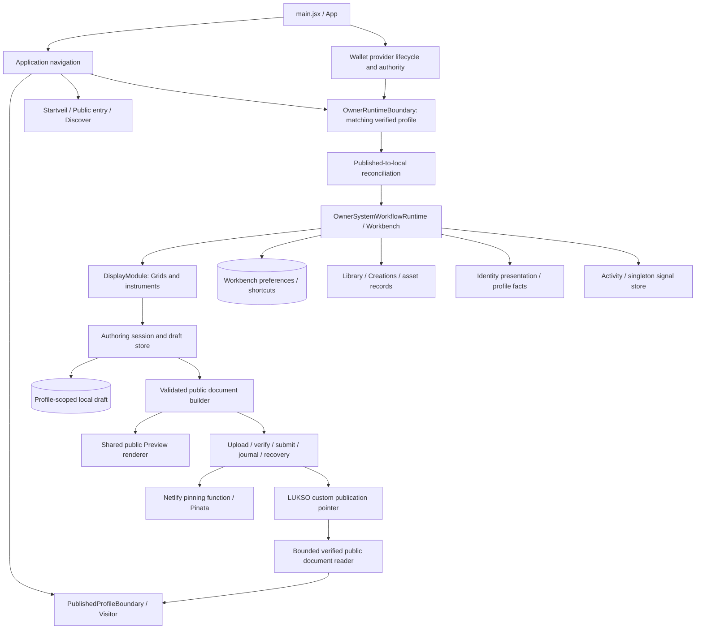

# INSCAPE independent application audit — 2026-09-08

**Status: partial verification; read-only audit.** The application surface was mapped, representative production callers and state owners were traced, and substantial local execution was performed. This is not a release certification. Live wallet authority, real publication transactions, deployed infrastructure, physical phones, and several browser transitions remain unverified. The exact failed and unexecuted checks are recorded below.

## 1. Candid assessment and baseline

INSCAPE is a functioning composition editor with a shared public renderer and a carefully guarded publication pipeline. It has useful separation between navigation, wallet authority, authored draft operations, temporary Display interactions, and public document reads. Populated compositions, image choice, crop, Layers, instrument movement, Identity editing, and publication recovery have meaningful local regression evidence.

Its most serious problems sit where otherwise reasonable components are connected. Automatic restoration can overwrite existing private work when a publication baseline is missing. The live restoration mapper also discards a placement's selected image; a different, tested mapper preserves it but has no production caller. Activity settings can write to the previous profile. Cold asset references depend on opening Library, and the RPC metadata fallback loses its timeout during body reading. These are concrete defects, not conclusions drawn from file size or architectural appearance.

The accepted direction is broader than the implementation. The active contract describes a modular creative Workbench, distinct Cover and Entry, public presentation, and authored versus visitor-local state. Creative intent explains why composition, relationships, and living behavior matter. Current code implements primarily one Display Module, ordered Grids, a dedicated WORLD COVER Grid, and Identity/public presentation. It does not establish the complete accepted module, composition-metadata, or living-world model. Those differences are unfinished product work, not evidence that current functions are broken.

### Baseline and audit constraints

- Branch: `feature/presentation-board-foundation`.
- Commit: `df8ffca4fe606092191a5341da86876e7c3e51b0`.
- Baseline captured at `2026-09-08T20:48:57+02:00`; tracked working tree clean.
- Existing untracked entries: `docs/INSCAPE_ALPHA_CONTINUATION_HANDOFF.md`, `docs/INSCAPE_APPLICATION_AUDIT_2026-09-06.md`, `docs/INSCAPE_EDITOR_HARDENING_2026-09-06.md`, `docs/INSCAPE_MAINTENANCE_REVIEW_2026-09-06.md`, `docs/INSCAPE_SPATIAL_WORLDS_BRAINDUMP_2026-09-05.md`, `exports/`, `output/`, `public/assets/noise-samples/blue-noise/`, `public/recovery/`, and `scripts/recover-creeps-images.mjs`. Listing these names is baseline accounting; their contents were not used as authority or audit evidence.
- Authority read: AGENTS.md, the active contract, creative intent, and LUKSO engineering baseline. The publication operations reference was consulted only for the installed Node setup. No prior audits, Git history, archived plans, or continuation handoff were consulted.
- Installed tools: PowerShell, Git, ripgrep, Node **24.20.0**, npm **11.19.0**, Playwright Core **1.61.1**, Microsoft Edge **152.0.4191.66**, Vite **6.4.3**, and esbuild **0.25.12**. Default-shell Node 18 was unsuitable; the already-installed Node 24 was invoked explicitly. No installation was performed.
- Artifact directory: [output/audit-2026-09-08-independent](../output/audit-2026-09-08-independent/). Synthetic profiles, in-memory stores, disposable browser contexts, loopback servers, mocked uploads, and a separate build output were used. No real upload, wallet prompt, signature, transaction, deployment, commit, or push was performed.
- Application source, dependency manifests, configuration, and user-owned documents were not edited. This report and local verification artifacts are the deliverables. Nothing was simplified or fixed during the audit.

## 2. Application map, ownership, and coverage

**Coverage vocabulary:** “Exercised” means a concrete local behavior ran; it is not blanket approval. “Partially verified” means source and/or some executions support the area, with material limits. “Inspected” means source/callers were reviewed without direct execution of that behavior. “Unverified” identifies evidence still required.

| Area | Actual entry and authoritative owner | Coverage and material limit |
|---|---|---|
| Startup, owner/visitor entry, routing | `main.jsx`, `App.jsx`, `profileDiscovery/applicationNavigation.js`, `useApplicationNavigation.js` | **Partially verified.** Real-App routing assertions passed; suite cleanup failed. Startup integration aborted under Windows watcher errors. |
| Wallet and account changes | `store/useWalletStore.js`, provider lifecycle, `wallet/standaloneWalletSession.js`; authority is distinct from viewed-profile navigation | **Partially verified.** Unit simulations and production-preview synthetic provider reached owner readiness. Real extension/account/controller transitions unverified. |
| Workbench and window lifecycle | `OwnerSystemWorkflowRuntime.jsx`, `ownerSystemWorkflowModuleState.js`, layout/panel hooks, `workbenchPreferences.js`, shortcut storage | **Partially verified.** Open/close, responsive panels, instruments, shortcuts exercised. Older Board geometry/lifecycle assertions fail and need reconciliation. |
| Display, Grids, composition | `DisplayModule.jsx`, `OwnerSystemWorkflowCanvas.jsx`, `systemWorkflowAuthoringSession.js`, draft domain | **Exercised.** Grid navigation, playback, covered transitions, crop, locking/cancellation, populated scene. Limits: maximum-size worlds and all device/input combinations. |
| Selection, Layers, transformations | Display controller/session; `ownerSystemWorkflowSelection.js`, placement interaction and crop hooks; temporary visibility/instrument state stays local | **Exercised.** Multi-stage interactions, eyes, image selection, cancellation and stale-operation cases. Legacy inspector suite no longer mounts its expected surface. |
| Library, categories, source resolution | `library/state/useLibraryStore.js`; separate per-hook Creations store; workspace persistence and asset cache | **Partially verified.** Images and drag placement pass. Storage fixture crashes; cold referenced-asset defect reproduced; live collection breadth unverified. |
| Media rendering | progressive artwork sources/images, placement media, shared Grid renderer and focus viewer | **Exercised.** Selected image, crop, load failure/retry, HTTPS/IPFS rendering, 72 locally loaded artwork images. RPC body lifecycle has a separate defect. |
| Metadata and provenance | normalized asset records and field provenance; Metadata view model and Focus viewer consume them | **Partially verified.** Read/transform paths inspected; source versus placement identity retained in normal editing. Full composition/contributor metadata model unfinished. |
| Identity and account presentation | profile identity/facts caches; shared `IdentityModule.jsx`; authored card in draft/public document | **Exercised.** Seven dedicated browser cases cover Save/Cancel, QR, inline/expanded views and narrow geometry. Live identity fact completeness and physical GPU behavior unverified. |
| Drafts, restoration, storage failure | `systemWorkflowDraftStore.js`, authoring session; automatic reconciliation and separate baseline key | **Exercised with defects.** Old-data/unit cases pass; destructive baseline-less restoration and selected-image loss reproduced. Corrupt-data UI recovery inspected, not completed interactively. |
| Preview and public rendering | v9 builder/validation, `ProfileDocumentV9Visitor.jsx`, shared `GridProductionRenderer.jsx` | **Partially verified.** Visitor behavior assertions pass, including no owner storage access. Document-shrink crash reproduced. Some older full Preview workflows fail before completion. |
| Publication and recovery | publisher, upload client, publication journal/recovery, Netlify handler | **Partially verified.** Unit and fixture recovery/publication pass; mocked handler exercised. No live Pinata, wallet submission, receipt, or deployment test. |
| Discover and public entry | `profileDiscoveryController.js`, LUKSO discovery repository, shared cover renderer | **Partially verified.** Caller/state/cache and bounded-card strategy inspected; panel fixtures exercised. Live directory accuracy and current featured publication unverified. |
| Activity, Settings | `useOwnerSystemWorkflowActivity.js`, singleton `useSignalStore.js`, activity repository and signal storage | **Exercised with defect.** Cross-profile settings write reproduced. Speech/audio/visual-effect controls persist settings but have no active reaction consumer found. |
| Support and failure surfaces | `AlphaSupportPanel.jsx`, `alphaSupport.js`, startup/runtime error boundaries | **Partially verified.** Evidence sanitization/recovery unit coverage; production-preview support gate fails on an aborted request. No real support transmission performed. |
| Development-only recovery | DEV lazy import of `recovery/CreepsMetadataRecoveryPanel.jsx` at `/development/creeps-recovery` | **Inspected.** Reachable in development, excluded from production. Its transaction lifecycle has an independent weakness. No wallet action attempted. |
| Dependencies/build/security | `package.json`, lockfile, Vite build, production analysis, emitted browser/function imports, Netlify function | **Exercised.** Builds, budget checks and dependency advisory inventory completed. Deployment enforcement and broader attack testing unverified. |

### Representative end-to-end traces

1. **Place or transform artwork:** Library image choice becomes a scoped placement request; the Display controller creates a domain candidate; the authoring session checks its current draft/generation; the draft store validates and persists before accepting it; Canvas and Layers derive the rendered result. Selection, crop preview, instrument placement, and layer-eye hiding are not a second saved composition.
2. **Edit Identity:** shared Identity settings hold a temporary candidate; Save checks the original card/details and commits through the authoring session; Cancel discards the candidate; the builder copies authored presentation into v9; the public Identity component reads the same presentation shape. Live profile facts remain separate inputs.
3. **Reopen an owner's published workspace:** App resolves the publication; the reconciliation boundary imports the storage mapper; that mapper compares local/public fingerprints and a separately stored baseline; it can write the draft before the owner runtime mounts. This path owns the restoration defects in F1/F2.
4. **Publish and revisit:** build a public-only canonical document; prepare and upload; verify returned CID/content; recheck draft and wallet context; submit the custom pointer; retain the transaction journal; resolve receipt/readback; the public reader verifies profile/network/pointer/content before the shared renderer receives it. No ownership is conferred by asset attribution.
5. **Switch profiles and open Settings:** navigation and the owner component reset correctly, but the global Activity store changes profile only when Activity becomes active. Settings writes that global store directly. The host's visible profile and persistence target therefore diverge in F3.

## 3. Strong boundaries worth preserving

- **Authored state has a real transaction boundary.** The draft store validates versions/identifiers, returns detached data, preserves corrupt bytes, checks already-visible external writes, and accepts a change only after persistence. The session rejects obsolete candidates. This is useful protection, although localStorage comparison is not an atomic lock between simultaneous tabs.
- **Navigation is distinct from wallet authority.** A viewed profile is not automatically an editable workspace. Owner runtime entry requires the explicit authoring decision and matching normalized profile, with remount/error boundaries keyed by profile. Unit simulations and real-App routing assertions support this separation.
- **Display interactions have an identifiable owner.** Display owns crop/focus/playback/instruments; Workbench hosts windows and local preferences. Moving an instrument and selecting a Grid do not inherently choose unrelated wallet or navigation state. The current singleton module model does not justify a speculative plugin framework.
- **Public read and publication write boundaries are substantially stronger than restoration.** Canonical v9 validation, bounded public-document reads, obsolete-request guards, stale verified-document handling, profile/network checks, public-only serialization, submission journaling, and read-only recovery have meaningful tests. Keep these boundaries when repairing their callers.
- **Identity and asset facts are not simply flattened into ownership.** Normalization and provenance retain creator/holding distinctions, while authored Identity presentation remains separate from LSP3 and contract facts. Caches have explicit lifetime/concurrency policies rather than becoming authored records. Identity clouds own and clean up their animation/GPU resources and respect visibility/reduced motion; physical-device performance remains unknown.
- **Shared rendering provides parity evidence.** Owner Preview and visitor use common document/rendering paths. Visitor browser assertions verified media fallback, keyboard input, narrow controls, and no owner-store reads/writes. This is stronger evidence than matching component names, while the revision transition in F6 still fails.

## 4. Prioritized findings

Severity describes consequence in the stated workflow. Confidence describes the strength of the evidence. A high-confidence finding is not automatically high severity. The first six findings have isolated reproductions against current application functions/components; no real user data was used.

### F1 — Automatic restoration can overwrite valid private or unpublished work

**Confirmed defect. Severity: High. Confidence: High. Fix before further feature work involving real drafts.**

**Problem and trigger:** an owner has a valid existing local draft and a resolved or stale published document, but the separate publication-baseline record is absent, corrupt, or unreadable. `reconcileOwnerDraftWithPublishedProfile` protects local changes only when a truthy baseline exists and its fingerprint differs. Otherwise it commits the imported publication over the existing draft, including removal of private Grids.

**References:** [ownerDraftReconciliation.js](../src/profileDocument/storage/ownerDraftReconciliation.js), `reconcileOwnerDraftWithPublishedProfile`, lines 90–118; [OwnerSystemWorkflowReconciliationBoundary.jsx](../src/public/ownerSystemWorkflow/OwnerSystemWorkflowReconciliationBoundary.jsx), automatic import/reconcile effect; `ownerPublicationBaselineStorage.js`, baseline read/error handling. The caller marks READY after any returned status, including failed hydration or missing-baseline outcomes.

**Evidence:** [reproductions.json](../output/audit-2026-09-08-independent/reproductions.json), generated by `reproduce.mjs`: a valid `grid:private-draft` titled `UNPUBLISHED PRIVATE WORK` disappeared and was replaced by `grid:public-home`, `PUBLIC SNAPSHOT`; status was `HYDRATED_FROM_PUBLISHED`. Both the draft and baseline keys were written. The existing reconciliation unit test explicitly accepts replacement of an unrelated baseline-less local draft, so a passing suite does not protect the current guardrail. Draft and baseline are separate writes; a baseline-write failure leaves the same dangerous prerequisite for a later visit.

**Consequence:** silent loss of unpublished work on ordinary owner entry, with no review step or recovery copy.

**Smallest correction:** distinguish an absent draft from a valid existing draft. Preserve existing work when its baseline cannot establish safe replacement; expose a concrete reconciliation choice if replacement is needed. Keep baseline read failures distinct from absence and surface persistence failures. Do not reset data or introduce another synchronized draft store.

**Regression:** exercise the automatic owner-entry caller with absent, corrupt and denied baseline reads, existing private/unpublished content, a stale public document, and a failed baseline write. Existing work must survive. A truly absent local draft must still restore successfully.

### F2 — The production restoration mapper loses the selected placement image

**Confirmed defect and conflicting responsibility. Severity: Medium. Confidence: High. Repair with F1.**

**Problem and trigger:** a published placement uses an alternate image of an asset. The live mapper restores only `stableAssetId` and geometry; it drops the published `asset.media` choice. Subsequent resolution can select the asset's default image, changing the composition or a republished document.

**References:** `ownerDraftReconciliation.js`, `createOwnerDraftFromPublishedProfile` / `restoredGrid`, lines 32–47; [profileDocumentV9Builder.js](../src/profileDocument/domain/profileDocumentV9Builder.js), selected-media resolution at lines 56–59 and 86–89; [profileDocumentV9Reconciliation.js](../src/profileDocument/domain/profileDocumentV9Reconciliation.js), `restoredPublicGrid`, lines 9–26.

**Evidence:** [restore-selected-image.json](../output/audit-2026-09-08-independent/restore-selected-image.json): published alternate image `alternate.png` at 900×600 becomes `actualRestoredSelectedMedia: null`; rebuilding with the same asset record selects its default `abyssal_eye/full.webp` at 2000×2000. The other domain mapper preserves the alternate image. Caller search found that mapper only in tests and a barrel export, with no production consumer. This is an evidenced competing restoration implementation, not a recommendation to consolidate merely similar code. Avatar media is preserved in the live mapper; the demonstrated loss concerns Grid/world-cover placements.

**Consequence:** restored appearance differs from the published work even when the asset identity is unchanged; tests cover the mapper the live restoration path does not use.

**Smallest correction:** establish one production restoration transformation, preserving selected media and deliberate private-content semantics. Remove the superseded path when safe, rather than patching two independent mappers indefinitely.

**Regression:** publish → actual storage reconciliation → owner reload → rebuild, with two placements of the same asset choosing different images, world cover, and avatar. Check media URLs/dimensions and rendered results, not only token IDs.

### F3 — Settings can persist changes to the previous profile

**Confirmed defect. Severity: Medium. Confidence: High. Fix before expanding account-scoped features.**

**Problem and trigger:** after profile A used Activity, switch to B and open Settings before opening Activity. `useOwnerSystemWorkflowActivity` initializes the singleton signal store only while Activity is active. Settings subscribes to and mutates that singleton without an expected-profile argument; its persistence target can remain A. The global unread indicator is also derived without enforcing the displayed profile.

**References:** [useOwnerSystemWorkflowActivity.js](../src/public/ownerSystemWorkflow/useOwnerSystemWorkflowActivity.js), profile effect at lines 54–57 and returned entries/unread count; [OwnerSystemWorkflowSettings.jsx](../src/public/ownerSystemWorkflow/OwnerSystemWorkflowSettings.jsx), lines 22–28; [useSignalStore.js](../src/signals/state/useSignalStore.js), `setProfileAddress`, `updateSetting`, deferred persistence; Runtime's activity activation and global-bar unread input.

**Evidence:** [browser-reproductions.json](../output/audit-2026-09-08-independent/browser-reproductions.json): the actual hook and Settings rendered profile `0x222…222`, while the store stayed `0x111…111`. Toggling notifications wrote only `os-underneath.keeper-signals.v1:0x111…111`. This is a component integration reproduction; the complete live-wallet A→B sequence was not performed.

**Consequence:** preferences are changed for the wrong profile and activity badges may describe the previous account.

**Smallest correction:** bind Activity state at the owner/profile lifecycle boundary independently of panel visibility. Scope Settings mutations and displayed counts to the expected profile, rejecting obsolete callbacks.

**Regression:** through App, change A→B while Activity is closed, then open Settings first. Verify B's values and storage, A's preservation, correct unread badge, and ignored late requests/timers from A.

### F4 — Cold persisted asset references depend on opening Library

**Confirmed wiring defect. Severity: Medium. Confidence: High.**

**Problem and trigger:** a fresh owner runtime has saved placements but no useful held-asset cache, and Library remains closed. Its per-hook Creations store starts without a profile. Only optional inventory loading sets that profile. The separate reference-resolution effect fires, but the store rejects the call because its profile is still null; the effect does not depend on the Creations profile becoming ready.

**References:** [useOwnerLatticeBrowser.js](../src/public/useOwnerLatticeBrowser.js), store creation at line 33 and effects at lines 73–82; [useCreationsStore.js](../src/creations/state/useCreationsStore.js), `resolveReferencedAssets`, line 81 onward; Runtime's inventory-enabled argument and Canvas's missing-media fallback.

**Evidence:** the actual hook was mounted with inventory disabled and a valid referenced asset ID in a fresh context. `browser-reproductions.json` records no resolved records and no external requests. Source tracing explains the early return. A warm cache can hide the failure; selected-media URLs can preserve some pixels even while their asset record is unresolved.

**Consequence:** persisted compositions can initially show missing-media placeholders or lack metadata until an unrelated inventory action initializes the resolver. Restoration in a new browser is particularly exposed.

**Smallest correction:** initialize the referenced-asset store's profile independently of optional full inventory loading and trigger resolution when that profile is ready. Keep reference loading bounded and cancellable; do not make an asset cache a second authored source of truth.

**Regression:** cold open with Library closed, a token-only saved placement, and controlled successful/failed metadata responses. Verify request, rendered media, metadata, failure state/retry, and cancellation after profile change.

### F5 — RPC metadata timeout ends at headers, leaving the body unbounded

**Confirmed defect. Severity: Medium. Confidence: High.**

**Problem and trigger:** fallback metadata fetch resolves headers promptly but its JSON body stalls or is very large. `fetchMetadataDocument` returns `response.json()` from a try/finally without awaiting it. The finally block immediately clears the timeout and removes the outer abort listener. There is no body byte limit. An outer timeout that merely aborts the signal cannot terminate this detached body read.

**References:** [luksoRpcProfileRepository.js](../src/library/data/luksoRpcProfileRepository.js), `fetchMetadataDocument`, lines 207–228; contrast the already-existing bounded [fetchMetadataJson.js](../src/library/data/fetchMetadataJson.js), used elsewhere in asset resolution.

**Evidence:** `reproductions.json`: with a configured 20ms timeout, immediate response headers and a stalled JSON body, the operation remained pending after 120ms; its metadata request signal was still not aborted after cancellation. The synthetic body was explicitly released afterward. No remote hostile server was contacted.

**Consequence:** Library fallback/repair can remain loading and retain obsolete work; oversized metadata can impose unnecessary memory/parse cost. Other readers' strong cancellation does not repair this path.

**Smallest correction:** reuse the existing bounded JSON-body reader for this path, retaining required verified data-URI/direct-image behavior. Ensure timeout and parent abort cover the complete read and cancel unused bodies.

**Regression:** stalled body after headers, oversized chunked body without Content-Length, parent cancellation, profile switch, and partial batch failure. The promise must settle, resources must close, and the UI must distinguish failure from successful emptiness.

### F6 — A refreshed publication with fewer Grids crashes the visitor

**Confirmed defect. Severity: Medium. Confidence: High.**

**Problem and trigger:** a visitor is on a later Grid, then the same document receives a new revision containing fewer Grids, for example a stale-result retry. The component computes `document.grids[activeIndex]` before its effect resets `activeIndex`, then dereferences `activeGrid.id` during render.

**References:** [ProfileDocumentV9Visitor.jsx](../src/profileDocument/components/ProfileDocumentV9Visitor.jsx), lines 29, 49, 54 and 190–206; Preview wrappers do not key the renderer by revision; `usePublishedProfile` can replace a retained stale document with a fresh result.

**Evidence:** actual Preview mounted with two Grids; ArrowRight selected the second; a valid next revision with one Grid replaced it. `browser-reproductions.json` records `Cannot read properties of undefined (reading 'id')` and zero remaining visitor roots. App's outer error boundary can show the reload surface instead of the empty isolated root.

**Consequence:** ordinary public refresh can terminate the current visit despite both documents being valid.

**Smallest correction:** derive a valid selected Grid synchronously for the current document, or explicitly reset the visitor session at the document/revision boundary. A post-render effect alone is insufficient.

**Regression:** stale→resolved update reducing the Grid count while viewing the last Grid, in both Visitor and Preview; check navigation, focus recovery, closed stale viewer sessions, and absence of page errors.

### F7 — Preserved corrupt drafts have no meaningful in-app recovery path

**Evidenced recovery gap. Severity: Medium. Confidence: High for the source path; browser recovery not exercised end to end.**

**Problem and trigger:** draft bytes are corrupt or storage cannot be read. The store correctly refuses to invent an empty successful draft. `createSystemWorkflowAuthoringSession` immediately calls `getDraft`, which throws. The owner error boundary offers RELOAD and support details; reloading the same corrupt bytes repeats the failure. The guarded `resetCorruptDraft` operation has tests but no UI consumer was found.

**References:** `systemWorkflowDraftStore.js`, `getDraft` and `resetCorruptDraft`; `systemWorkflowAuthoringSession.js:62`; [OwnerRuntimeBoundary.jsx](../src/public/OwnerRuntimeBoundary.jsx), error render; [StartupDestinationContext.jsx](../src/startveil/StartupDestinationContext.jsx), `StartupDestinationFailure` and reload action.

**Evidence:** corrupt/unavailable store cases are covered by the passing unit suite, and their thrown error leads directly into the inspected owner failure surface. Synthetic invalid audit-fixture drafts also produced the expected storage-corrupt exception; those fixture mistakes are not separate application defects.

**Consequence:** user data is preserved, but the user is stranded without a way to inspect/export it or perform a deliberate recovery. Temporary read denial and permanent corruption receive substantially the same loading-failure advice.

**Smallest correction:** provide recovery before authoring-session construction, retaining original bytes and distinguishing unavailable storage from corrupt data. Offer meaningful retry/export/support and a profile/fingerprint-bound explicit reset or restore only after the user chooses it.

**Regression:** corrupt bytes survive reload and export; stale recovery actions cannot overwrite another profile or newer data; temporary read denial can recover without reset; successful recovery mounts the owner runtime.

### F8 — Development recovery can submit with stale context and forget a submitted hash

**Evidenced transaction-lifecycle weakness, development only. Severity: High if this route is used; no demonstrated production exposure. Confidence: High from source tracing.**

**Problem and trigger:** `/development/creeps-recovery` checks `canSubmit` at click time, then awaits owner/value reads and simulation before invoking the captured wallet client. It does not recheck current provider/profile generation adjacent to submission. After receiving a hash, a receipt/readback failure replaces status with an error object that omits the hash and permits another submission attempt.

**References:** `App.jsx`, DEV-only lazy recovery import and route; [CreepsMetadataRecoveryPanel.jsx](../src/recovery/CreepsMetadataRecoveryPanel.jsx), `canSubmit`, `submit`, lines 35–89. It is reachable development code, not dead code. Production build exclusion was checked.

**Evidence:** direct execution-path inspection: `writeContract` follows awaited `simulateContract`; `waitForTransactionReceipt` follows hash assignment; the catch overwrites that assignment with `{ phase: 'error', message }`. No transaction was triggered to demonstrate this.

**Consequence:** someone using this one-off development tool can cross an account-change boundary or retry an ambiguous already-submitted action. The stronger main publisher's journal does not protect this separate path.

**Smallest correction:** retire/disable the action if its one-off purpose is complete. If retained, reuse concrete authority rechecks and durable hash/recovery semantics from the publisher, without creating a general transaction framework.

**Regression:** fake wallet/provider switches during delayed simulation; no stale-context write occurs. Fake receipt timeout after hash delivery retains that hash and offers read-only reconciliation, never a second submission by ordinary retry.

### F9 — Pinning expenditure is guarded by Origin and IP limits, not profile authority

**Evidenced external-service exposure / unresolved access policy. Severity: Medium if publicly deployed with credentials. Confidence: High for handler behavior; deployment abuse resistance unverified.**

**Problem and trigger:** any client able to POST a valid document with a matching Origin can reach the credentialed pinning operation. A non-browser client can supply that header. The handler validates canonical content, profile/network shape, body size and request origin, but does not verify that the caller controls the document's profile or belongs to an allowed upload audience.

**References:** [pin-profile-document.mjs](../netlify/functions/pin-profile-document.mjs), Origin check at lines 25–26, credentialed upstream request around line 63, configured per-IP limit at line 97.

**Evidence:** an in-memory request with a synthetic valid document and matching Origin, but no authentication, returned **201** and invoked the mocked upstream once (`reproductions.json`). No actual pinning occurred. The configured limit is 12 requests/IP/hour; remote enforcement was not tested.

**Consequence:** credentialed storage/quota can be consumed by callers outside the intended audience. This does **not** authorize modification of another profile's on-chain publication pointer; that remains a separate wallet boundary.

**Smallest correction:** explicitly decide the upload audience before unsupervised exposure. If restricted to owners/testers, enforce an appropriate bounded authorization/admission check at this function while retaining canonical validation and rate limits. If intentionally anonymous, document that decision and verify operational quota controls; do not describe Origin as authentication.

**Regression:** test the chosen authorized/unauthorized policy using a mocked upstream, then verify the deployed function's actual rate/quota behavior under separately authorized operational testing.

### F10 — Browser verification no longer provides a reliable current release signal

**Confirmed verification gap. Severity: Medium. Confidence: High.**

**Problem and trigger:** several tests assert superseded interfaces, one fixture passes an obsolete Library input, Windows self-hosted suites watch their own temporary browser files, and production-preview diagnostics fail on an aborted Envio request. These failures prevent the full supported workflow set from yielding a trustworthy green/red signal.

**References and evidence:** `library-storage-fixture.jsx:21–25` passes `controller` but omits the current workspace references; the isolated fixture throws `undefined.current`. Inspector and canvas suites await removed controls. Projection expects a viewport-filling Grid despite the current bounded Display. Presentation-board tests include outdated menu/preference shapes but also geometry failures not independently resolved. `vite.config.js:22–25` ignores the exact `.browser-test-runtime` directory while real-App suites create suffixed runtime directories; the root-run log records EBUSY on their Edge Cookies files. `browser-test-lifecycle.mjs` reports browser-server-close deadlines. Production/support preview gates reach owner readiness and then fail on `POST …/v1/graphql net::ERR_ABORTED`. See the exact execution matrix below.

**Consequence:** broken tests can obscure real regressions, and successful unit/model tests can validate an unused mapper or an unsafe restoration expectation. The production-preview abort cannot simply be dismissed as harmless without tracing its request lifecycle.

**Smallest correction:** repair the lifecycle/fixture prerequisites, then align affected behavioral tests with the current accepted interface. Keep meaningful assertions and diagnose abort ownership; do not blanket-ignore browser errors or alter the app to satisfy obsolete layouts. Retain distinct tests for current owner, visitor and Preview transitions.

**Regression:** run the relevant existing commands from a clean Windows workspace without watcher failures or leaked processes, and make each failing interaction either pass under the accepted behavior or produce a reproducible application finding. Add integration regressions for F1–F6 through their actual callers.

### F11 — The owner JavaScript budget measures a facade, not owner startup

**Evidenced measurement weakness. Severity: Low. Confidence: High.**

**Problem and trigger:** the owner entry introduces a second lazy boundary. `analyzeProductionBuild` follows only static imports from the owner facade. The owner-specific total therefore excludes the dynamically imported runtime and can stay tiny while owner-startup code grows.

**References:** [productionBuild.js](../scripts/productionBuild.js), `analyzeProductionBuild`, especially `ownerKeys = manifestClosure(...)` around line 355; `OwnerSystemWorkflowReconciliationBoundary.jsx` lazy runtime import; `productionBuild.test.js`, nested-facade classification test.

**Evidence:** fresh report: `ownerJavaScript.raw = 1,947`, while the emitted `OwnerSystemWorkflowRuntime` chunk alone is **310,734 bytes**. The owner graph and full emitted-module inventory confirm the latter contains live Library and Activity code. Total/core budgets still include this code, so this is a gap in the owner-specific metric, not unbudgeted output everywhere.

**Consequence:** the owner budget is easily misread as the cost of opening the Workbench. Likewise, initial static JS is not the full standalone landing transfer: App automatically imports the wallet-session boundary on mount. The wallet closure includes optional descendants and is not itself a measured network transfer.

**Smallest correction:** name the facade metric honestly and measure the concrete owner-ready dependency/request path separately. Keep total/core limits and avoid counting every optional lazy tool as mandatory startup.

**Regression:** a representative nested-lazy manifest/runtime fixture must charge growth in the required runtime to the owner-ready metric, while an optional unopened tool remains separate; validate against a captured production request trace.

## 5. Verification results, presentation, and security limits

### Executed commands and artifacts

All npm/test commands used the existing Node 24 toolchain. No dependencies or source configuration were changed. Builds were redirected away from the normal deployment output.

| Check | Exact action / result |
|---|---|
| Full unit suite | `npm test` — **760 passed, 0 failed, 0 skipped**, approximately 29.5 seconds. [Log](../output/audit-2026-09-08-independent/unit-tests.log). |
| Standards suite | `npm run test:lukso-standards` — **5 passed, 0 failed**. [Log](../output/audit-2026-09-08-independent/lukso-standards.log). |
| Production build | `npm run build -- --outDir output/audit-2026-09-08-independent/build` — passed, approximately 14.8 seconds; Vite warned about large chunks. |
| Build check | `npm run build:check -- output/audit-2026-09-08-independent/build` — passed. [Bundle report](../output/audit-2026-09-08-independent/build/bundle-report.json). |
| Dependency audit | `npm audit --json` — exit 1 for reported advisories, not a tool failure. [Inventory](../output/audit-2026-09-08-independent/npm-audit.json). |
| Dependency paths | `npm explain form-data request tar axios --json`; separate audit-only Vite module-inventory build; in-memory esbuild import graph of the Netlify function. [Exposure classification](../output/audit-2026-09-08-independent/dependency-exposure.json). |
| Isolated reproductions | `node output/audit-2026-09-08-independent/reproduce.mjs`, `restore-selected.mjs`, `browser-reproduce.mjs`, and `visual-performance.mjs`. Inputs are synthetic; upload/network behavior is mocked or blocked. |
| Browser fixtures | Existing test files executed via `node --test <absolute browser-test path>`, with loopback dev/preview URLs and output redirected into the audit directory. [Runner](../output/audit-2026-09-08-independent/run-browsers-rerun.mjs), [results](../output/audit-2026-09-08-independent/browser-results-rerun.json), [remaining-suite results](../output/audit-2026-09-08-independent/browser-results-remaining.json). |
| Real-App integration rerun | `node --test --test-concurrency=1 browser-tests/published-visitor.browser.mjs browser-tests/owner-profile-routing.browser.mjs browser-tests/startup.browser.mjs` from repository root — exit 1; **16 passing test cases, 12 failures** in the runner summary, plus failed suite cleanup. [Log](../output/audit-2026-09-08-independent/app-integration-root.log). |

The first audit dev-server attempt failed because Vite watched newly written artifacts. The audit-only server was then given a `configResolved` hook disabling watching; repository configuration was unchanged. Three suites initially failed from the isolated working directory because their Vite configuration assumed the repository cwd, so they were rerun from root as shown above. These initial harness failures are retained in logs and are not application findings. A remaining-suite runner was interrupted before reaching a legacy test that uses the shared runtime directory, then restarted for the four safely isolated suites. The substantive results below refer to the completed reruns.

### Browser execution matrix

Names below are files under `browser-tests/`, each ending `.browser.mjs`. Counts are test cases as reported by that file, not an assertion count. A failing suite is not called green because some child assertions passed.

| Test file | Result and interpretation |
|---|---|
| `controller-hardening` | 1 pass. |
| `placement-cancellation` | 1 pass. |
| `display-instruments` | 3 pass. |
| `layer-visibility` | 1 pass. |
| `library-images` | 1 pass, covering wide and smaller desktop layouts. |
| `shortcut-image-drop` | 1 pass. |
| `identity-module` | 7 pass. |
| `grid-wrap`, `grid-seam`, `grid-playback`, `grid-preview-readiness`, `grid-covered-wrap` | Each 1 pass. |
| `publication-recovery`, `owner-system-workflow-publication` | Each 1 pass. |
| `owner-system-workflow-crop` | 2 pass. |
| `owner-system-workflow-panels` | 4 pass. |
| `library-storage` | 1 fail. Fixture crashes on missing current workspace reference before category behavior can be tested. |
| `owner-library-resize` | 1 fail. Shrink expectation differs from current minimum/responsive sizing; not independently established as an app defect. |
| `owner-system-workflow-canvas` | 1 pass, 1 fail awaiting removed `Board zoom` slider. |
| `owner-system-workflow-library` | 1 fail: expected old 980px geometry, actual 440px. |
| `owner-system-workflow-inspector` | 1 fail awaiting old `Selection and layers inspector` surface. |
| `owner-system-workflow-projection` | 1 fail expecting a viewport-filling Grid; actual bounded Display canvas is 1085×610 at the sampled wide viewport. |
| `owner-system-workflow-presentation-board` | 1 pass, 6 fail, 3 pre-existing skips. Shortcut behavior passes; menu/preference expectations have drifted. Resize/position/artwork-only failures remain unresolved. |
| `owner-system-workflow-phase3-completion` | 5 fail. First case's image locator matches both progressive image layers; other cases also encounter fixture image files absent from the isolated cwd. Full legacy Profile/Focus/Preview sequences therefore remain unverified. |
| `owner-profile-routing`, `published-visitor` | Initial isolated-cwd setup failed; root rerun reached and passed their behavior cases, then both suites failed cleanup. Windows watcher EBUSY and browser-close deadlines recorded. |
| `startup` | Initial setup failed; root rerun aborted under watcher EBUSY and later cases were reported as unable to start because the parent finished. No clean startup-suite result. |
| `owner-system-workflow-production`, `alpha-support-preview` | Each 1 fail after synthetic owner readiness, due to unexpected aborted Envio request. Production/support gate not cleared. |
| `owner-lattice-identity` | **Not executed.** Its source fixes runtime output to the repository's shared `.browser-test-runtime`; it was excluded to preserve existing artifacts. Current Identity behavior was exercised by the seven-case `identity-module` suite. |

Thus **29 of 30 browser test files were attempted**, with additional root integration reruns and isolated reproductions. This is broad coverage, but it is explicitly not a fully passing browser suite. The phase3 fixture-path issue and interrupted first remaining-suite attempt are audit harness limitations; they must not be counted as product regressions.

### Populated presentation and measured performance

The actual owner Shell was mounted with safe local artwork in a validated synthetic draft: two authored Grids, 36 placements per Grid, 7 distinct image sources, overlapping transparent artwork, and the current Layers instrument. All media was local; no real profile storage was read. Screenshots were inspected, not merely generated:

- [Populated owner, 1440×900](../output/audit-2026-09-08-independent/populated-owner-1440.png): Display and Layers align as bounded windows; rows are contained; transparent artwork retains its intended alpha.
- [Populated owner, 390×900](../output/audit-2026-09-08-independent/populated-owner-390.png): composition remains above the Layers window, global controls remain inside the viewport, and the dense list is contained. This does not establish that every tiny authoring handle is comfortable on touch.
- Existing instrument screenshots at 390×560 and wide viewports, plus expanded Identity at 390px, were inspected for clipping/alignment and containment. Their browser assertions cover focus/selection/reopen and Identity Save/Cancel/QR behavior. Some original fixture screenshots block remote thumbnail URLs; the fully local populated capture avoids confusing that fixture restriction with application media failure.

[visual-performance.json](../output/audit-2026-09-08-independent/visual-performance.json) records **36 active placements, 72 mounted artwork images, 0 broken images, 0 horizontal document overflow, and 0 page errors** at both measured widths. A 2.5-second requestAnimationFrame sample after starting Grid playback produced 359 samples per viewport: wide p50 6.9ms / p95 7.1ms, narrow p50 7.0ms / p95 7.0ms; maximum approximately 7.1ms. Reported JS heap was approximately 37.8MB and 36.9MB. These are desktop Edge scheduling observations in a dev fixture, not calibrated frame-render timings, GPU-memory measurements, or a long-duration leak test.

The existing covered-wrap test used a 4096×2304 local raster: **737 captured frames at 2044px and 935 at 390px, zero detected Stage leaks**. Together, the captures support rendering correctness with covered artwork. They do not measure network performance, maximum 200-placement Grids, 24-Grid worlds, physical mobile thermals, Safari/Firefox behavior, or prolonged GPU/resource retention.

Fresh build totals: initial static JS **784,709 raw / 229,557 gzip bytes**; total JS **5,902,644 / 1,619,328**; standalone-wallet reachable closure **4,545,415 / 1,208,411**; initial CSS **30,872 / 6,061**; owner CSS **123,210 / 16,981**. Public assets total **14,416,715 bytes**. These are output sizes, not measured transfer costs. See F11 for the owner facade metric and automatic standalone wallet initialization. The wallet graph is a measured concentration of output cost; no dependency swap or unsupported downgrade is justified solely by these totals.

### Dependency advisories and actual exposure

The npm inventory reports **87 affected packages: 10 low, 59 moderate, 15 high, 3 critical**. These are package/advisory classifications, including inherited severity, not 87 demonstrated application vulnerabilities.

The audit compared installed affected paths against **3,777 rendered browser module paths** from a fresh audit-only build and **442 function import paths** from bundling the current pinning function in memory. This is more specific than searching only the lockfile or the three owner-marker modules in the normal build report. See `emitted-module-inventory.json`, `function-import-graph.json`, `dependency-paths.json`, and `dependency-exposure.json` in the artifact directory.

| Exposure class | Evidence and practical interpretation |
|---|---|
| Vulnerable Node/transitive packages | Critical package entries are `form-data`, `request`, and `tar`; high entries include `axios`, old Web3/Truffle dependencies and others. None of their affected installed paths appeared in the rendered browser or upload-function graphs. They remain installed dependency/supply-chain maintenance exposure, not demonstrated production exploit paths. |
| Dependency ancestry | `npm explain` traces the older request/tar family through LUKSO wallet/component/contract dependencies into `solidity-bytes-utils`, Truffle wallet provider and legacy Web3. Axios is also inherited through the Coinbase SDK branch. These are not direct application imports of the vulnerable Node libraries. |
| Browser-reachable affected parent packages | Eleven moderate inherited entries appear: `@lukso/core`, `@lukso/lsp26-contracts`, `@lukso/lsp6-contracts`, `@lukso/lsp7-contracts`, `@lukso/lsp8-contracts`, `@lukso/lsp9-contracts`, `@lukso/transaction-decoder`, `@lukso/transaction-view-headless`, `@lukso/universalprofile-contracts`, `@lukso/up-modal`, and `@lukso/web-components`. Their entries have no direct advisory object; inheritance does not prove the vulnerable descendant executes in the browser. |
| Upload function | No affected package path from this inventory appeared in its measured graph. The function uses native fetch/FormData and server-side `PINATA_JWT`; F9 concerns who may consume that capability, not a vulnerable multipart library in the function. |
| Build/development | Node-only installed tools/transitives are a distinct environment from emitted browser code. The audit did not run hostile extraction/build inputs or comprehensively inspect install scripts. No forced fix, override, installation, or downgrade was attempted. |

Current maintainer evidence supports this scope distinction. The form-data advisory concerns predictable multipart boundaries in affected library versions under specific attacker capabilities; no affected form-data module was found in the emitted graphs. [Maintainer advisory](https://github.com/form-data/form-data/security/advisories/GHSA-fjxv-7rqg-78g4). The node-tar advisory concerns archive extraction/path traversal, a different operation from the browser renderer or current upload function. [Maintainer advisory](https://github.com/isaacs/node-tar/security/advisories/GHSA-34x7-hfp2-rc4v).

A supported upstream dependency cleanup is reasonable when the wallet/build boundary is next changed. Its acceptance check should include installed-path reachability, standalone connection/session restoration, publication-context behavior, and emitted sizes. The current count alone does not justify disabling working application features, replacing the wallet stack, or claiming an exploitable critical browser vulnerability.

### Wallet, metadata, URLs, and publication security

The reviewed authority path distinguishes Universal Profile/provider authority from contract ownership and viewed identity. Controller checks and chain restrictions have unit evidence, but real extension delegation, controller changes, rejection, replacement and account switches during an actual wallet request remain unverified. The production gate uses a synthetic provider; it cannot establish real-wallet correctness.

Metadata semantics were checked against the required baseline and current official documentation. LSP5 is a received-asset registry, not proof of a present balance; LSP12 records issued assets, not current holding or sole creative authorship. The current record/provenance separation should be retained. [Official LSP5 documentation](https://docs.lukso.tech/standards/metadata/lsp5-received-assets/), [official LSP12 documentation](https://docs.lukso.tech/standards/metadata/lsp12-issued-assets/). Profile controller permissions and metadata verification are separate subjects as documented by [LSP6 Key Manager](https://docs.lukso.tech/standards/access-control/lsp6-key-manager/) and [LSP2 JSON Schema](https://docs.lukso.tech/standards/metadata/lsp2-json-schema/). The five local standards tests are guardrail checks, not certification of all live chain facts. This audit makes no claim that INSCAPE's current custom publication format is a finalized LSP28 implementation.

The public publication reader validates canonical content, expected profile/network and pointer data, bounds body reads, and binds results to their originating request. Upload and pointer submission remain distinct stages. The main publisher retains ambiguous transaction state and supports read-only recovery. Those protections were reviewed and exercised with mocks; deployment/wallet enforcement remains outside this audit.

Source searches found no application use of `dangerouslySetInnerHTML`, `eval`, or `new Function`. Canonical publication media URLs are constrained and visitor media uses no-referrer behavior; browser tests exercise an actual CSP response header blocking disallowed media. This is useful evidence, not a complete XSS/SSRF penetration test. Library fallback metadata still has F5's body-lifecycle issue. Broad media sources, external gateways, remote SVG behavior, remote content substitution, and browser-specific policies were not exhaustively attacked.

The pinning credential is read from the server environment rather than exposed through a browser variable. Support evidence uses a bounded allowlisted record and redacts URL/private-token-like content; only deliberate copy/support presentation was reviewed, with no message sent. This audit did not inspect or print secret values, prove the deployment's actual CSP/rate limits, or certify all remote service configuration.

### Unfinished accepted work and optional improvements

These are product scope observations, not additional confirmed defects or instructions to implement all creative ideas now.

| Accepted direction / meaning | Current implementation and next boundary |
|---|---|
| Independent Cover and Entry, lightweight Discover snapshot | v9 still serializes a dedicated WORLD COVER Grid and ordered public Grids; Discover renders that cover through the Grid renderer. Independently chosen existing public Cover/Entry and publication-time raster poster semantics are not established. This needs an explicit compatible schema/publication change, not a cosmetic Discover patch. |
| Module instances and authored public configuration | Current hosting is largely a singleton Display/Identity/lifecycle arrangement. Draft v4 and public v9 do not establish the complete authored module-instance/public desktop/connection model. Existing working state should be preserved when a concrete next module makes that boundary necessary. |
| Source, placement and composition metadata | Stable asset identity, per-placement selected media and source provenance exist. Current inspectors remain narrower than the full three-scope narrative/contributor model. The next Metadata feature should extend the appropriate authored scope while keeping source claims separate. |
| Living entities, audio and connected behavior | Creative intent explicitly treats examples as experiments. Persisted speech/audio/visual-effect switches and a reaction-queue method are not proof of an active living-entity runtime; no production consumer of those reactions was found. Defer the broader system until a concrete experiment has a defined owner and lifecycle. |
| Long-term optimization | Wallet output and full-resolution media are worth measuring on representative networks/devices. They are measured output costs or bounded test observations, not evidence that a speculative renderer rewrite would help. |

No generic architecture replacement, extra styling system, broad module framework, or cosmetic redesign is recommended by this audit.

## 6. Short dependency-ordered remediation plan

### Fix before further feature work

1. **Protect real saved work at restoration (F1/F2).** First define safe absent-versus-existing behavior and baseline failure states. Then make the live caller use one lossless restoration transformation. Prove private-work and selected-image roundtrips before exposing real drafts to more owner-entry changes. This is the smallest architectural cleanup directly justified by the audit.
2. **Restore profile and asynchronous scope (F3–F6).** Initialize profile-bound Activity and reference resolution at their actual owner lifecycle; keep inventory/panel visibility optional. Repair the RPC body deadline and visitor revision transition. These can be small independent changes, each verified through its existing caller rather than another parallel wrapper.
3. **Repair the verification prerequisite for those changes (F10).** Correct fixtures and test-owned watcher/cleanup behavior, then add the actual boundary regressions. Resolve the production-preview abort before treating the build as a release checkpoint. Do not postpone the data-preservation fix until every old browser test is perfect.

Before anyone uses the development recovery action again, address F8 or disable that action. Before unsupervised public upload access, resolve F9's audience and verify the deployed policy. These are exposure conditions, not prerequisites for isolated composition experiments.

### Fix alongside the next affected feature

- Add meaningful corrupt/unavailable-draft recovery (F7) with the next persistence/restoration surface; preserve/export original bytes before an explicit reset or restore.
- Correct owner-ready measurement and collect a real production request trace (F11) with the next startup/wallet performance change.
- Use supported upstream releases to remove obsolete dependency branches when changing wallet/build integration; rerun standards, account-lifecycle, production and bundle checks without forced fixes.
- Implement Cover/Entry/public module-state compatibility when that accepted product feature is actually taken on. Include representative v4/v9 reads and migration/roundtrip checks; do not silently repurpose old keys or overwrite drafts.

### Safely defer

- A general module/plugin framework, speculative shared connection protocol, animation/audio platform, or renderer rewrite.
- Broad cosmetic redesign and replacing established interface primitives.
- Maximum-scale performance optimization before representative measured limits identify the relevant bottleneck.

“Defer” does not mean ignore failing evidence: the present incomplete browser and live-device coverage remains an explicit release limit.

## 7. Unknowns and evidence needed to resolve them

| Unknown | What would resolve it |
|---|---|
| Real UP extension, standalone wallet and controller authority during transitions | Separately authorized tests with disposable profiles/providers: connect/restore/disconnect, account and chain changes while pending, controller rejection/revocation, and confirmed read-only authority checks. No such wallet action was taken here. |
| Actual publication upload, receipt, replacement and readback | Separately authorized test deployment/Pinata and disposable-profile publication, including denied upload, wrong CID, rejected signature, receipt timeout/replacement and recovery without duplicate submission. |
| Deployed CSP, Origin/rate/quota behavior and secrets configuration | Read-only deployment configuration/header review plus explicitly authorized controlled endpoint verification. Local mocks and generated headers do not prove production enforcement. |
| Startup and production-preview clean behavior | Repair test-owned watcher/cleanup isolation, trace the aborted Envio request, and rerun the existing root/production suites without suppressing unexpected failures. |
| Older Board geometry, Focus/Profile and full Preview transitions | Correct fixture paths and obsolete locators first; rerun failed presentation-board/phase3 cases; independently reproduce remaining geometry failures against accepted behavior. |
| Legacy owner Identity suite | Isolate its output/cleanup from the existing shared runtime directory, then run it or replace obsolete scenarios with equivalent current Identity behavior. The new seven-case suite does not prove every old scenario. |
| Live Library/Discover completeness and metadata diversity | Representative held/created/issued collections, incomplete indexer responses, direct RPC fallback, unavailable/corrupt metadata and slow gateways, preserving source/scope in results. |
| Physical phone performance, input comfort, accessibility and long sessions | Physical iOS/Android devices, screen-reader/keyboard review, touch interaction, reduced motion, populated multi-Grid scenes, sustained playback and repeated Identity mount/unmount with memory/GPU observations. |
| Concurrent-tab draft and publication correctness | Simultaneous writers, denied storage, event ordering, Web Locks unavailable, stale candidates and interrupted baseline/journal writes. Existing localStorage comparison covers visible prior writes, not atomic cross-tab transactions. |
| Future schema compatibility for modules/Cover/Entry | A concrete accepted schema change, explicit old-data read/migration policy and representative saved/published fixtures. Current rendering success cannot answer this design question. |

## Final assessment

**Can development continue safely?** Yes, in isolated fixtures and reversible local work. Protect real drafts through F1/F2 and fix profile scoping before expanding owner workflows. Do not treat current browser results as a release clearance; resolve the production gate and obtain the separately authorized live evidence before publishing a release. Do not use the development recovery action or expose credentialed anonymous pinning on the assumption that the main publisher's protections cover them.

**What can reasonably be trusted?** The validated authored-operation/store boundary, normal Display/image/crop/instrument behaviors, shared Identity editing, canonical public rendering, and the main publisher's mocked journal/recovery behavior have concrete supporting tests. Trust is limited to their exercised transitions. Restoration, profile Settings, cold reference initialization, stalled fallback metadata, and shrinking publication revisions demonstrably need repair.

**The three actions with the greatest immediate value are:**

1. Make automatic restoration preserve existing work and selected media through one production mapper.
2. Repair profile/request ownership in Activity, cold asset resolution and metadata reading, plus safe visitor revision selection.
3. Restore reliable browser/release verification and add end-to-end regressions for those actual callers.

All work from this audit is local and uncommitted. No fixes, dependency changes, commits, pushes, uploads, deployments, or wallet actions were performed. The mapped surface is broad; the unverified workflows and devices above are the reason this report remains explicitly partial.
