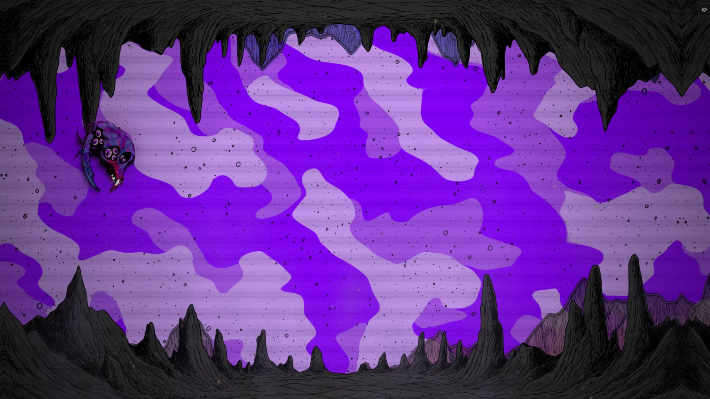
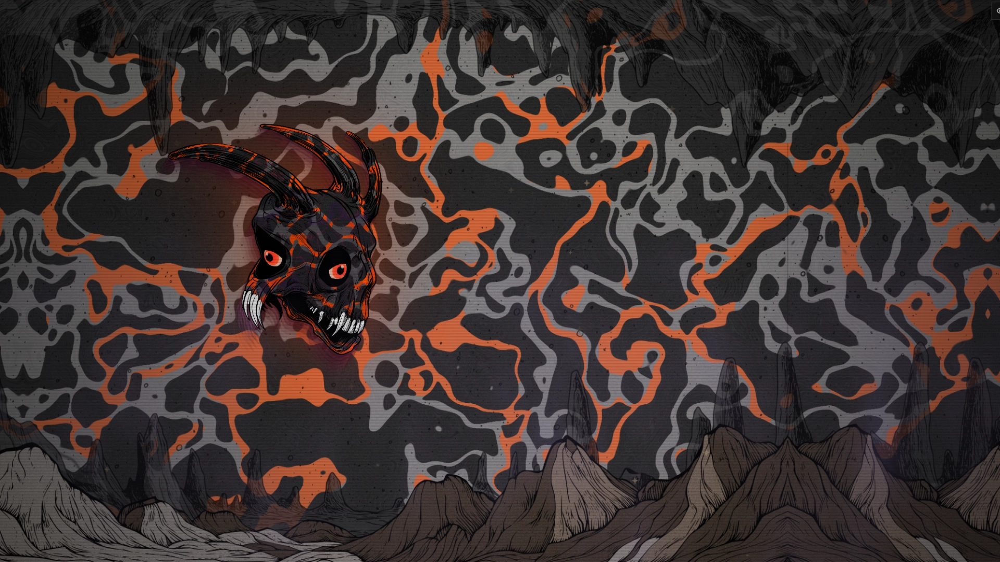
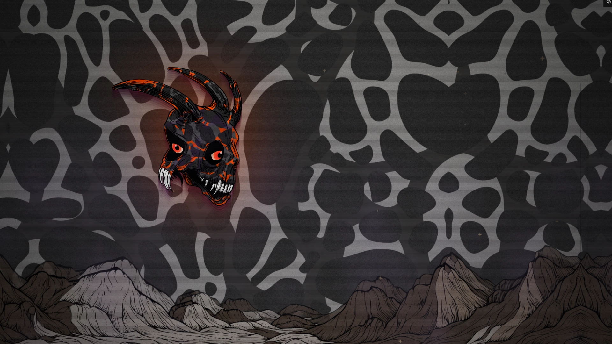

# Human Underneath — Art Direction

## Purpose

This document is the shared visual reference for Human Underneath. It should be
read before making decisions about the public application shell, profile
applications, dialogue, character presentation, motion, or theme systems.

Human Underneath is a living illustrated profile-world, not a conventional
website with an animated background. The environment and its resident character
are the primary experience. Interface elements should feel as though they
belong to that world while remaining calm and readable enough to carry useful
profile, collection, media, and social information.

This is an evolving document:

- **Established** qualities are visible repeatedly in the supplied artwork and
  should be treated as requirements.
- **Exploratory** qualities are not yet resolved and require owner approval
  before they become a repeated system.

## Core Identity

The visual language combines hand-inked surreal biology, creature and skull
anatomy, graphic-novel linework, flat psychedelic color, deep black structure,
and illustrated science-fiction environments. The work can move between
vibrant chromatic worlds and stark monochrome landscapes without losing its
identity.

The characters feel simultaneously hostile, vulnerable, curious, and alive.
Large eyes create immediate personality; horns, teeth, claws, skull cavities,
and asymmetric growth create danger and strangeness. They should never be
reduced to decorative mascots.

The interface may introduce technical, archival, signal-like, or
operating-system structure, but it must not overwrite the illustration with an
unrelated cyberpunk or corporate design language.

## Established Principles

- The world remains visible and visually important during interaction.
- The character is a resident and active presence, not wallpaper.
- Dense black linework provides structure across characters and environments.
- Silhouettes remain readable despite substantial interior detail.
- Imperfect contours, hatching, scratches, grain, and hand-drawn variation are
  part of the identity.
- Color is applied in decisive graphic regions rather than soft ornamental
  gradients.
- Saturated accents coexist with large black, charcoal, grey, or empty areas.
- The composition can contain significant negative space. It does not need to
  be filled with interface controls.
- Environmental layers create depth like an illustrated side-scrolling stage.
- Engine phenomena may distort, echo, illuminate, or temporarily transform the
  artwork, but the underlying drawing remains recognizable.
- Different characters and worlds may have radically different palettes.

## Still Exploratory

The supplied references establish the artwork, not a final public interface.
The following remain open design questions:

- exact window geometry and framing;
- public typography and type scale;
- application icon construction;
- dialogue-box shape and placement;
- how applications accommodate a moving character;
- window opening, closing, and minimizing transitions;
- exact translucency, blur, tint, and refraction treatment across different
  world palettes;
- how much illustration is appropriate inside functional content surfaces;
- sound, voice, and ambient interface treatment.

Implementations should label decisions in these areas as provisional and stop
for visual approval before applying them broadly.

## Character Design

### Form

- Favor asymmetry, unexpected anatomy, layered shells, cavities, horns, hooked
  appendages, teeth, and clustered eyes.
- Use bold outer contours with finer hatching and structural lines inside.
- Preserve a strong overall silhouette at small on-screen scale.
- Eyes are major personality anchors. Their scale, grouping, and direction can
  communicate awareness even when the rest of the form is unfamiliar.
- Dark cavities and negative spaces are as important as colored surfaces.

### Color

- Character palettes use a small number of decisive colors against black or
  charcoal structure.
- Cream eyes and teeth can supply sharp focal contrast.
- Accent placement may follow stripes, cracks, plates, or anatomical regions.
- Purple and magenta belong to one demonstrated character; orange, coral,
  indigo, grey, cream, and near-black demonstrate that the collection is not
  bound to one global palette.

## Environment and Composition

- Treat the viewport as an illustrated world rather than a page background.
- Foreground and ceiling silhouettes may frame the viewport like a cave,
  aperture, or stage.
- Distant ridges, floor formations, suspended bodies, and atmospheric pattern
  fields establish multiple depth planes.
- Broad abstract background patterns may contrast with densely inked foreground
  forms.
- Sparse monochrome worlds are equally valid. The art direction is carried by
  line quality, composition, and atmosphere as much as by color.
- Leave navigable negative space around important actors and UI. Do not assume
  every empty region should be filled.

## Line, Texture, and Surface

### Use

- visible black ink contours;
- varied line weight;
- hatching that follows volume and material;
- irregular scratches, specks, grain, and hand-drawn imperfections;
- overlapping translucent environmental layers;
- restrained scanline or signal texture when it supports the scene;
- hard-edged flat color fields interrupted by drawn detail.

### Avoid

- generic vector-illustration smoothness;
- perfectly sterile geometry as the dominant visual language;
- soft gradients used as a substitute for drawing;
- uniform procedural noise applied indiscriminately;
- unrelated circuit-board or neon-cyberpunk decoration;
- textures so dense that content and interaction states become unreadable.

## Color System

Black and near-black form the shared structural base. Bone, cream, grey, or
off-white can provide readable contrast. Saturated colors should be supplied by
the active character/world theme rather than assumed globally.

The current purple cavern is an approved theme example, not the universal brand
palette. Public UI should eventually consume centralized theme tokens such as:

- structural black;
- surface and elevated-surface colors;
- primary and secondary accents;
- readable text and muted text;
- border/ink color;
- focus, success, warning, and destructive states;
- phenomenon glow or signal color.

Accessibility states must remain understandable when a world palette changes.
Do not communicate state through color alone.

## Translating the Art into UI

The UI should be quieter than the world. It should borrow structure and rhythm
from the artwork without turning every control into a miniature illustration.

### Appropriate Translation

- dark, restrained content surfaces with high text contrast;
- controlled translucent surfaces that allow the illustrated world to remain
  visibly continuous through functional content;
- blur, tint, and opacity tuned to preserve the active world's color energy
  and composition without sacrificing text contrast;
- fine ink-like or engraved borders used selectively;
- asymmetry or organic interruption in prominent frames, not every button;
- large application icons conceived as artifacts, specimens, instruments,
  signals, or objects belonging to the resident character;
- sparse signal marks, hatching, or texture around titles and transitions;
- animation that resembles scanning, pulsing, breathing, echoing, ink reveal,
  transmission, or temporary interference;
- enough empty space for the world and character to remain present.

### Inappropriate Translation

- a generic white NFT marketplace placed over the scene;
- a conventional SaaS dashboard;
- default blue accents;
- generic glassmorphism used as a complete borrowed visual style;
- uniform frosted cards applied to every piece of content;
- blur or tint strong enough to reduce the world to indistinct decoration;
- translucent surfaces without sufficient separation from busy linework;
- rounded cards used everywhere by default;
- direct Windows or macOS imitation;
- conventional desktop-window chrome repeated without adapting its geometry to
  the illustrated world;
- permanent panels that cover most of the illustrated world;
- unrelated stock iconography presented as final art;
- arbitrary serial numbers, telemetry, system codes, or pseudo-technical labels
  used primarily as decoration;
- repeated micro-labels that make the experience read as a terminal, laboratory
  dashboard, or spaceship control panel by default;
- bouncy, playful consumer-app animation;
- decorative complexity that makes text and transactions ambiguous.

Translucency is an approved material direction when it keeps the environment
present and visually active through the interface. It should be treated as
world-permeable UI rather than as a generic glassmorphism preset: the active
illustration supplies the color and atmosphere, while the interface supplies
readability, focus, and deliberate framing. Not every control or surface needs
to be translucent.

Technical language should be semantic. Codes, classifications, channel states,
and signal terminology are appropriate when they communicate real identity,
provenance, navigation, or system state. They should not be added only to make
the interface appear futuristic.

Familiar controls and symbols are still appropriate when they improve safety or
immediate comprehension. Character does not justify obscuring navigation,
wallet confirmation, focus, loading, failure, or destructive actions.

## Stable System vs. Character Theme

The application needs a stable interaction system while allowing each profile
world to feel authored.

### Stable Across Profiles

- spacing and hierarchy;
- minimum contrast and readable typography;
- keyboard and pointer behavior;
- window management conventions;
- loading, empty, error, and transaction states;
- accessibility and reduced-motion behavior;
- safe layout zones for the moving character.

### Supplied or Influenced by the Active Theme

- accent palette and surface tint;
- border ornamentation;
- application icon artwork;
- environmental layers and pattern fields;
- signal, glow, and phenomenon colors;
- dialogue personality and decorative treatment;
- ambient motion and, later, sound treatment.

## Motion and Phenomena

- Ordinary movement should let the world breathe without making every layer
  compete for attention.
- Reactions may briefly become intense, but they should have a readable onset,
  peak, and decay.
- Trails, displacement, glow, color separation, and surface phenomena should
  feel attached to the character or event rather than like a permanent UI
  filter.
- The character must remain identifiable through the effect.
- Persistent ambient motion and short event reactions should be treated as
  different layers of behavior.
- UI transitions should be more restrained than character reactions.
- Reduced-motion mode must replace large movement and repeated interference
  with quieter state changes.

## Reference Index

The files below are source references, not implementation assets unless a task
explicitly says otherwise.

### Full World Composition

`images/Full.webp` establishes the complete application-world composition. A
heavy hand-inked cavern silhouette frames a broad purple pattern field. The
small character occupies only a fraction of the viewport, leaving substantial
space for movement and future interaction. Fine debris, grain, scanlines, and
layered floor formations keep the broad color field from feeling flat. The
important lesson is that the frame, background, character, and empty space work
together; UI should not automatically occupy the open center.

### Character Range

`images/other characters.webp` demonstrates collection-level consistency
without palette uniformity. The three designs vary between orange and charcoal,
coral and indigo, and black, grey, cream, and fluorescent orange. They remain
related through skull-like construction, black cavities, exaggerated eyes,
hooked teeth, asymmetric horns, strong silhouettes, graphic color regions, and
fine ink texture. A future theme system must preserve this range rather than
forcing every profile toward the purple example.

### Character Line and Color

`images/lineart vs color.webp` isolates the character against black so its
construction is easy to read. Large flat violet regions are articulated by
curved black striations and fine hatching. Cream-and-purple eyes and white teeth
create crisp focal points, while magenta marks cut through the cooler body
colors. The empty half of the composition also confirms that asymmetry and
negative space are intentional rather than unfinished.

### Alternate Complete World

`images/Untitled.webp` shows the black-and-orange character embedded in a fuller
theme. An organic grey, black, and orange pattern occupies the far field;
translucent cavern shapes and illustrated mountain formations create foreground
and midground depth. The character palette is echoed by the world without
making the actor disappear into it. Muted brown-grey terrain prevents the accent
orange from becoming visually exhausting.

### Monochrome Side-Scrolling World

`images/uncollored side scroller.webp` proves that Human Underneath is not
dependent on psychedelic color. These panoramic lunar or alien landscapes use
white space, precise black contour, hatching, distant ridges, craters, wreckage,
and small narrative structures to imply a side-scrolling journey. Density is
concentrated around terrain and story objects while the sky remains mostly
open. The UI must be able to function over both dark chromatic scenes and bright
monochrome scenes.

### Reduced Theme Variation

`images/variation.webp` is a quieter variation of the orange theme. The organic
far-field pattern is simplified, environmental layering is reduced, and the
character becomes the primary chromatic focus. It is useful evidence that a
profile world does not need maximum detail or maximum saturation at all times.
The shared visual identity survives through the actor, illustrated ground,
texture, and controlled contrast.

### Phenomena and Shader Motion

[Open the phenomena and shader motion reference](images/phenomena-shaders.mp4)

`images/phenomena-shaders.mp4` demonstrates the character and cavern world in
motion across multiple phenomena treatments. The base illustration stays
recognizable while opacity, trailing, echoing, deformation, glow, and related
surface behavior change around it. Several effects leave spatial history behind
the actor rather than replacing its drawing. Use this as evidence that motion
can be expressive and technically strange while remaining anchored to the
authored character.

### Event Reaction

[Open the event reaction reference](<images/event reaction.mp4>)

`images/event reaction.mp4` demonstrates a short event-scale transformation.
The sequence moves through color separation/interference, a dark violet energy
burst, and a bright orange-gold vein or fissure state before settling. The
effect is intense but temporary, with a clear progression and return toward the
normal presentation. This is the preferred model for event feedback: an
authored reaction with onset, peak, and decay rather than a permanent filter.

## Review Rule for Future Tasks

Before making substantial public UI changes, read this document completely and
inspect the references relevant to the task. Preserve the established qualities
above. Identify any new visual language as provisional and stop for owner visual
approval before repeating it across the application.

When a first representative application icon and window are created, review
them in the moving world before using them as a system for the remaining public
applications.
