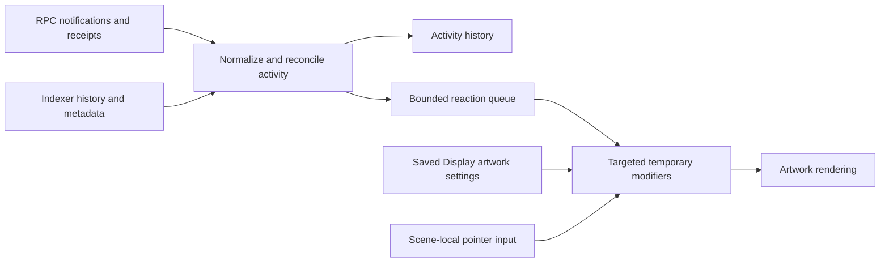

# Atelier, interactive artwork and LSP1 — research, 19 September 2026

This is an investigation and recommendation, not accepted product direction or a new roadmap. The active contract remains authoritative. No application implementation, dependency, wallet configuration or publication was changed during this research.

**Conclusion:** a contained Pixi integration is a sensible fit for the creature's internal materials. Click movement and beam aiming are achievable without converting the Workbench into a Pixi application. The archive supplies substantial useful work, but restoring its entire engine or reconnecting its old event service would carry avoidable coupling and confirmed correctness defects. The next step should be a small rendering experiment using the actual creature, beam and composition.

**Evidence and recovery**

I inspected the current working tree, including the locally implemented persistent groups, and read the active contract, creative intent and LUKSO baseline. Historical code was inspected at the user's request as implementation evidence.

The archive at `E:\VSCODE\Inscape Archive\INSCAPE-full-pre-deep-clean-2026-08-26.bundle` passes `git bundle verify`, records complete history and contains 37 refs. Its SHA-256 matches the manifest:
`7E57AE9B7BE530904DC8F01DAAFA34CFEA9796B99A311A5B840176A840C34D43`.

The relevant local tag is `archive/pre-deep-clean-2026-08-26`, commit `88c8f44d762a9247c083e0888f0f588c828c3d66`. The older Cavern Descent tag points to `789ae9495538a74db927948e90d970cb631d020a`; its gameplay is not a prerequisite for this integration. The manifest says the archive tags were not pushed when created. Remote GitHub tag availability was not verified; the local bundle is sufficient for recovery.

Earlier in this conversation, 37 frames were sampled from `analyze.mp4` at 0.25-second intervals across its roughly 9.2 seconds. The creature and separate beam move together; the footage does not demonstrate pointer-directed aiming. In this research pass I also inspected the archived creature's separate mask, line art, five patterns and eye resources.

**What is actually implemented**

| Capability | Current application | Archived Atelier |
| --- | --- | --- |
| Persistent artwork grouping | Present in the local working tree: Grid-owned membership, group Float/Flicker, shared selection and operations | One composed actor hierarchy; not the current general Display grouping workflow |
| Float | CSS figure-eight movement; group members share animation time | Actor flight dynamics with different motion, tilt and height-dependent scale |
| Click movement | No corresponding creature travel runtime in Display | `actorMovement.js` and `PixiEngine.updateMouseClick` |
| Beam aiming | No authored emitter/target behavior | `SearchlightSystem`: procedural tapered beam aimed at pointer |
| Internal purple materials | Display renders selected images | Masked patterns, warp filters, line art, eyes, weather/vein overlays |
| Pixi dependency | Absent from current package and installed node_modules | Lockfile pins Pixi 8.19.0 and pixi-filters 6.1.5 |
| Activity | Indexer-backed history, initial load and explicit refresh | Direct LSP1 stream plus separate history/reaction infrastructure |
| Live artwork reactions | No active consumer of the retained reaction queue found | Atelier hooks connect notifications to the old artwork store |

Current Activity's retained queue functions are not evidence of a running visual-reaction system. Likewise, the archived `KeeperSignalsLayer` exists, but no component mounting it was found in the inspected tag. It should not be described as a verified second live path in that snapshot.

Current responsibilities are sufficiently distinct to preserve:
- Display's session owns authored placement geometry, groups, selection and undo.
- The profile draft store and v9 builder/validation/reconciliation own saving, publication and restoration.
- Library and metadata retain source identity independently of placement behavior.
- Workbench owns module windows and temporary view geometry.
- Animation edits effects through an explicit target and scoped action.
- Signals owns activity facts and preferences; it should not manipulate artwork stores directly.

Relevant current files: `src/systemWorkflow/domain/placementGroups.js`, `systemWorkflowGroups.js`, `src/animation/placementMotion.js`, `useGroupMotion.js`, `useSceneMotion.js`, `src/public/ownerSystemWorkflow/OwnerSystemWorkflowCanvas.jsx`, `src/public/ownerSystemWorkflow/systemWorkflowArtboardProjection.js`, `src/profileDocument/components/GridProductionRenderer.jsx`, and `src/signals/`.

**What to reuse, and what to replace**

| Archived source at 88c8f44 | Useful part | Integration work needed |
| --- | --- | --- |
| `src/engine/entities/actorMovement.js` | Separate target and baseline, bounded travel, arrival | Use Display coordinates and group/actor pivot; retain temporary travel |
| `src/engine/systems/FlightDynamics.js` | Independent motion calculation | Its behavior differs from existing Float; do not silently reinterpret saved animations |
| `src/engine/entities/ActorEntity.js` | Mask → patterns → line art → eyes, local warp pointer | Extract minimum body rendering; remove mandatory mutation/weather/trail passes and actor-global assumptions |
| `src/engine/systems/SearchlightSystem.js` | Direction and distance calculations | Replace circular perimeter origin with an authored attachment point; preserve the user's beam artwork |
| `src/engine/systems/RenderTextureManager.js` | Dirty checks and pattern-pass accounting | Separate actor material resources from background ownership; bound resolution |
| `src/config/reactionProfiles.js` | Pure time-dependent modifiers over authored baseline | Feed explicit event inputs; keep blockchain decoding outside shaders |
| `src/engine/assets/AssetResolver.js` | Asset-role conventions | Replace sequential filename probing with a small explicit resource description |
| `src/engine/PixiEngine.js`, `ArtCanvas.jsx` | Some initialization/disposal safeguards | Do not restore whole-screen, singleton store, resident/avatar handoff and global pointer behavior |
| `src/services/LSP1EventService.js` | Historical ABI/payload reference | Rebuild its narrow ingestion boundary; confirmed defects listed below |

The archived render-config normalization and serialization have useful tests. Their old document format and global store should not become a second authoring authority beside today's profile draft.

**The grouping and renderer decision**

There are two separate structures: a group of independent Display placements, and the internal layers of one prepared artwork. The creature and beam can remain separate source assets in one group. The creature's purple patterns, mask and eyes belong to its prepared representation. They do not need to become unrelated Workbench modules or lose their source attribution.

Start the experiment by rendering one prepared creature inside its existing placement surface. Its outer placement/group retains the existing geometry and Float. Its Pixi content supplies the internal material effect. Keep the beam as its original placement and add an explicit attachment/aim relationship when needed. This minimizes interference with the current editor.

This is a bounded experiment, not a scalable commitment to one WebGL context per layer. Test several simultaneous prepared creatures and Displays before choosing the production canvas strategy.

A single scene-wide canvas has an important compatibility cost: current groups can contain non-adjacent layers with unrelated artwork or rich Text between them. Flattening a group into one canvas would change that order. Pixi RenderLayer can separate logical parent transforms from draw order within Pixi, but cannot put an HTML paragraph between two sprites inside one canvas. A full Display renderer migration would therefore need an explicit mixed HTML/canvas composition design. [Pixi render layers](https://pixijs.com/8.x/guides/concepts/render-layers)

Recommended first experiment:
- Preserve outer CSS Float while Pixi only animates internal materials. Do not run archived FlightDynamics on that same outer creature.
- Add temporary click travel as a distinct pose offset shared by the selected group.
- For exact beam aiming during Float, use the actual animated emitter pose. If this requires replacing CSS motion with a sampled runtime, give that target one motion owner and verify equivalence against existing keyframes before switching.
- Preserve the existing selected image as fallback for loading, unsupported resources, renderer failure and context loss.
- Keep owner and Visitor on the same representation implementation.

The scene's authored geometry remains immutable during playback. A useful composition is authored transform → temporary travel → shared idle motion → member-local transform. The beam then derives its origin from the creature's fully transformed attachment point and its endpoint from the pointer in the same scene coordinate space.

Use the existing Stage projection, including module position, Workbench zoom, scene swipe and image crop/flip. Do not reuse the archive's window-wide pointer normalization. Use a creature anchor for click destinations; the long beam's bounding box is a poor movement pivot. Limit travel using the creature's visible footprint. Boundaries should remain within the Stage for this first feature.

Aiming deliberately changes the beam's orientation/length. Ordinary grouping must still preserve the exact authored arrangement when aiming is disabled. Retaining a two-point beam definition—emitter and original tip—handles cropped or mirrored source art more reliably than treating image width as beam length. Preserve authored beam width unless a separate width response is chosen.

Click handling must resolve an actual conflict: Display already uses clicks for inspection and dragging for Grid swipes. An explicit interaction/preview mode is preferable to silently stealing existing gestures. Cancelled drags must not become travel clicks; Metadata, Text and window manipulation retain priority. Touch needs a target tap, and keyboard access needs equivalent targeting or movement. Reduced motion can snap travel and disable idle/material oscillation according to the existing preference.

**Asset and runtime overhead: measured source data**

All 26 WebP files in the archived `abyssal_eye` folder are 2000×2000. Together they occupy about 1.225 MiB encoded, but amount to **396.73 MiB of RGBA8 pixel storage** if all are expanded. This is arithmetic from actual dimensions, not a GPU-memory measurement.

The normal resolver finds 23 layered images: mask, line art, five patterns, and sixteen eye/pupil layers. Their RGBA8 total is approximately **350.95 MiB**, before render targets or driver overhead. The flattened preview and two unusually named ninth-eye files account for the remainder.

The sixteen discovered eye/pupil images alone represent **244.14 MiB** at full dimensions. Measured alpha bounds total approximately **0.237 MiB** of tightly cropped RGBA pixels before atlas padding. Preserve their original 2000×2000 coordinate offsets when trimming; otherwise the eyes move. Runtime frame rectangles over the original full texture do not save texture storage: the uploaded source must actually be smaller.

The ninth socket uses `9.webp` and `pupil9.webp`, while discovery asks for `eyeball.webp` and `pupil.webp`. It will not discover that socket. An explicit prepared-resource list avoids this naming-dependent omission.

Additional observed costs:
- ActorEntity allocates a full-size authored-source render texture and redraws it each update even with geometry mutation set to none.
- Pattern composition, alpha masks and filters can introduce additional offscreen passes.
- Searchlight clears its Graphics and creates a new gradient each update; a textured beam or reusable geometry is a better starting candidate for the user's beam.
- AssetResolver probes filenames serially through Image loads, with no timeout; a missing intermediate pattern ends discovery.
- Pixi Assets is global. The archive's alias/unload and `destroy(... texture: true)` assumptions require an ownership check before multiple instances share textures.

Prioritize trimmed/atlased eyes, display-appropriate material resolutions, lazy feature imports, inactive-pass removal and lifecycle cleanup. Pixi itself documents filter/mask costs and the value of explicit resource disposal. [Performance guidance](https://pixijs.com/8.x/guides/concepts/performance-tips), [resource management](https://pixijs.com/8.x/guides/concepts/garbage-collection)

Use WebGL as the initial backend for the archived GLSL work; Pixi's current guide recommends it for production. WebGPU can be evaluated separately. A plain Canvas2D fallback does not reproduce custom shader effects. [Renderer guidance](https://pixijs.com/8.x/guides/components/renderers), [custom filters](https://pixijs.com/8.x/guides/components/filters)

Current `src/public/identity/IdentityClouds.jsx` is a useful lifecycle example: local canvas ownership, bounded resolution, visibility pause, reduced motion, context-loss recovery and cleanup. Reuse those principles without moving Display behavior into Identity. Cross-origin images that display successfully in an img element still need appropriate CORS access for WebGL textures. Validate real publication/gateway resources and preserve fallback. [WebGL texture requirements](https://developer.mozilla.org/en-US/docs/Web/API/WebGL_API/Tutorial/Using_textures_in_WebGL)

**How the archived LSP1 attachment worked**

The inspected route was:

`AtelierExperience → useArtworkReactions → useLsp1Events → LSP1EventService`

The hook selected the old wallet store's host profile, opened a viem public WebSocket client, and watched that profile contract's UniversalReceiver event. It decoded a type ID, passed only `event.type` to `triggerArtworkReaction`, and set the singleton artwork store's activeReaction. Pixi observed that field and evaluated the matching reaction profile over time.

This was a browser listener, not a custom contract installed to make artwork animate. Read-only monitoring of existing UniversalReceiver logs needs no wallet signature or new receiver delegate. On-chain forwarding/rejection is a separate delegate feature. [LSP0 website monitoring](https://docs.lukso.tech/standards/accounts/lsp0-erc725account/), [LSP1](https://docs.lukso.tech/standards/accounts/lsp1-universal-receiver/)

| Event | Archived detection | Default visual profile |
| --- | --- | --- |
| Incoming LYX | LSP0ValueReceived | Yes |
| Incoming LSP7 | Recipient notification | Yes |
| Outgoing LSP7 | Sender notification | No |
| Incoming LSP8 | Recipient notification | Yes |
| Outgoing LSP8 | Sender notification | No |
| Outgoing LYX | No path in that listener | No |
| Follow/unfollow | Named mappings, but IDs mismatch the documented standard | No |

The LSP7/LSP8 payload distinguishes the token contract calling UniversalReceiver from the transfer's operator, sender and recipient. Its token amount/tokenId must be decoded from receivedData. UniversalReceiver.value is native value sent with the notification; it is not the token amount. [LSP7 specification](https://github.com/lukso-network/LIPs/blob/main/LSPs/LSP-7-DigitalAsset.md), [LSP8 specification](https://github.com/lukso-network/LIPs/blob/main/LSPs/LSP-8-IdentifiableDigitalAsset.md), [UniversalProfile ABI](https://docs.lukso.tech/contracts/contracts/UniversalProfile/)

Ordinary outgoing LYX through UP execute requires observing successful account execution with positive native value. A top-level transaction may be a controller/Key Manager call with zero transaction.value while the UP sends LYX internally. The current Transaction query alone is therefore not sufficient proof of complete outgoing coverage. Exact indexer handling of internal transfers was not verified live. Contract creation funding and other internal flows need explicit semantics if eventually included; a simple transfer reaction should not claim to cover every account balance change.

**Confirmed event defects and remaining gaps**

Eight offline characterization checks are saved with the research. They preserve the archived service method bodies while replacing imports, Vite environment lookup, transport and timers; no RPC or wallet was used.

1. On initial setup failure, the service schedules reconnect and then sets shouldBeConnected=false. Executing the scheduled callback produces no new connection attempt.
2. A valid incoming token payload containing amount 25 emits value "0", no decoded amount, and no transactionHash/logIndex. A malformed token payload still emits a recognized token-received event.
3. Removed logs are ignored without retracting the previous notification. Cleanup clears duplicate IDs, allowing the same log to emit again.
4. Current createSignalId collapses two same-contract, same-direction token logs in one transaction despite distinct source records. It omits chain and log index.
5. The current indexer repository accepts HTTP success with an empty object as complete, successful empty activity.
6. Archived default profiles activate for three incoming types only.
7. Archived movement reaches its bounded target without overshooting in the tested case.
8. Archived follower IDs differ from the current documented LSP26 hashes.

For LSP26, hashing the names in the official guide produces:
- Follow: `0x71e02f9f05bcd5816ec4f3134aa2e5a916669537ec6c77fe66ea595fabc2d51a`
- Unfollow: `0x9d3c0b4012b69658977b099bdaa51eff0f0460f421fba96d15669506c00d1c4f`

These match the installed official package constants. The archive instead uses values starting 0x8c6d5e and 0x7a01f8. Its raw-address follower payload decoding matches the installed implementation's packed address, but the notification identifiers do not. [Official LSP26 guide](https://docs.lukso.tech/standards/accounts/lsp26-follower-system/)

Other source-observed gaps: recent-ID retention is only ten entries; callback registration follows asynchronous setup; reconnect timers lack owned cancellation; there is no persisted block checkpoint/backfill; event timestamps use browser receipt time; simulations lack explicit provenance in the service output; activeReaction replaces preceding reactions rather than queueing them.

UniversalReceiver is a notification surface accepting arbitrary payloads. A recognized type ID alone should not be promoted to a verified asset transfer. Correlate the notifier and decoded endpoints with the successful transaction's appropriate token Transfer log; preserve uncertainty when unavailable. Even a verified historical transfer is not proof of current holding.

Documentation needs ABI-level care: the current summary event reference and UniversalProfile contract reference disagree about indexed fields in Executed. The installed official LSP0 0.15.5 artifact agrees with the contract reference: value is not indexed, selector is indexed. Import the supported contract ABI and test real receipt shapes rather than hand-copying the summary table. [Event summary](https://docs.lukso.tech/standards/event-reference/), [contract ABI reference](https://docs.lukso.tech/contracts/contracts/UniversalProfile/)

**Recommended event integration**

Use one profile/chain-scoped activity ingestion service, consumed by the Activity view and explicitly connected artwork. Keep transport, normalized facts, reaction scheduling and renderer parameters separate.

Recommended normalized facts retain chain ID, observed profile, transaction hash, log index, block hash/number, block timestamp, source, event type/direction, notifier/token contract, endpoints, amount/tokenId, and confirmation/removal status. Use strings for big integers at persistence boundaries.

Choose a canonical transfer occurrence when reconciling a token Transfer and its LSP1 notification. Their log indices differ; simply concatenating both sources creates duplicate reactions. Do not merge two distinct transfers merely because their transaction and token match. Where the indexer cannot provide a reliable occurrence identifier, retain source-specific history without automatically replaying an ambiguous duplicate.

Use bounded getLogs backfill around a block cursor and overlap/deduplication to close startup and reconnection gaps. A WebSocket is a notification mechanism, not durable history. viem supplies watches and unwatch functions; the app still owns checkpoints, cancellation, provider errors and reconciliation. [viem watchContractEvent](https://viem.sh/docs/contract/watchContractEvent)

Bind requests and timers to profile, chain and generation. One consumer closing must not dispose a shared connection still needed by another. Pause or release work when no consumers remain. Hidden-time catch-up updates history without unleashing a burst of stale effects. First load establishes a baseline; replay is explicit and marked.

For reactions, a mined event can be treated as provisional if prompt visual feedback is desired, with removal handled honestly. It must not grant authoring rights or claim finalized holdings. The artwork receives a bounded cue tied to a module/group/placement, never the wallet provider or signing authority. Public presentation would observe the published profile, independently of a visitor's connected account. That visitor behavior remains a proposal requiring product acceptance.

**Compatibility and a bounded implementation sequence**

The current placement media validator accepts exactly url, width and height. It cannot simply carry a layered package. Add a separate optional, declarative representation only when the experiment proves the required fields. Start with one prepared creature: original coordinate dimensions, bounded resource roles/order, fallback image, attachment points and validated material parameters. Shader implementations stay application-owned. Do not introduce arbitrary shader source or a general asset-package standard.

Any eventual saved representation/interaction extension must pass through draft validation, existing transactions/undo, duplication with remapped references, publication filtering and reconciliation. Old draft-v4/public-v9 documents retain the same interpretation when fields are absent. Group membership remains authoritative once; the runtime derives its hierarchy from that membership. Interrupted loading must never reset saved work.

Changing activity IDs also requires a compatibility step for existing history and knownSignalIds. Preserve legacy records; match them only when evidence is sufficient, and establish a fresh reaction baseline rather than replaying old transfers under new IDs. Missing historical log indices must remain unknown. Do not reset Activity preferences or history to make the new identity scheme load.

The first implementation can be split into reviewable outcomes:

1. **Visual/resource experiment:** actual creature layers plus existing beam in representative scenery; one restrained material effect; trimmed eyes; static fallback; record canvas/context count, frame timings, passes and texture sizes. Compare the placement-surface approach with a scene canvas only where existing stacking requires it.
2. **Interaction:** group click travel and exact emitter-to-pointer beam aiming; explicit interaction mode; preserve authoring, inspection, swipes and reduced motion. Keep everything temporary at this stage.
3. **Saved configuration:** only the proven representation and behavior settings, with old-document checks, undo and owner/Visitor parity.
4. **Activity repair:** canonical occurrence IDs, honest failed/partial reads, current constants, scoped lifecycle and historical/live reconciliation. Replace the old path; do not attach a second independent reaction listener.
5. **Reaction connection:** synthetic marked fixtures first, then read-only supported live events; independent mappings for incoming and outgoing behavior.

Expected difficulty is moderate for movement/beam geometry, moderate for a minimal prepared-actor renderer, and moderate-to-high for reliable live activity. A complete Display renderer replacement or a general shader/package editor is substantially larger and unnecessary for the immediate creature.

The representative rendering checks should include the actual scene at wide/narrow sizes, non-adjacent grouped layers with Text between them, crop/flip/rotation, Workbench zoom, two Displays, rapid open/close and asset switches, tab hiding, context loss and missing/CORS-blocked resources. Measure one, several and inactive actors. Report p50/p95 frame time, loading time, initial/lazy bundle bytes and resource growth after repeated closure. A 60 Hz frame target gives 16.7 ms per frame; this is a proposed target, not a measured result.

For event checks, include incoming/outgoing token receipts, ordinary UP native sends, batch transfers, two identical-looking logs in one transaction, self transfers, mint/burn, spoofed/malformed notifications, follow/unfollow, reconnect overlap, removal, profile change during load, delayed metadata, and fixtures that never enter live history.

**Verification and handoff**

- 23 current Signals tests and all five existing LUKSO standards audit tests passed under Node 24.20.0.
- 27 archived configuration/reaction/serialization tests passed from an isolated temporary snapshot.
- Eight additional offline characterization checks passed, confirming the observations above. These intentionally assert existing defects; they are not fixes or production regression coverage.
- Archive integrity and actual image dimensions/alpha bounds were checked. A layer contact sheet was visually inspected.
- Full archived Pixi rendering, device GPU performance, current endpoint availability, real transaction delivery and deployed ABI versions were not exercised. No FPS or production-readiness claim is made.
- No new full build or full application suite was run for this documentation-only investigation. The earlier grouping implementation and its checks are separate work.
- No architectural cleanup was implemented here. The multiple-renderer resource boundary, HTML/canvas stacking strategy and Activity reconciliation still need implementation evidence.
- Research files are local and uncommitted; nothing was pushed or deployed.

Supporting files: [offline checks](../../output/atelier-research-2026-09-19/checks.mjs), [check results](../../output/atelier-research-2026-09-19/checks-results.txt), [current test results](../../output/atelier-research-2026-09-19/current-tests.txt), [asset dimensions](../../output/atelier-research-2026-09-19/asset-sizes.json), [eye alpha bounds](../../output/atelier-research-2026-09-19/eye-trims.json), [layer contact sheet](../../output/atelier-research-2026-09-19/layers.jpg).

Video contact sheets from the earlier frame review: [1](../../output/atelier-research-2026-09-19/video-sheet-1.jpg), [2](../../output/atelier-research-2026-09-19/video-sheet-2.jpg), [3](../../output/atelier-research-2026-09-19/video-sheet-3.jpg), [4](../../output/atelier-research-2026-09-19/video-sheet-4.jpg).
